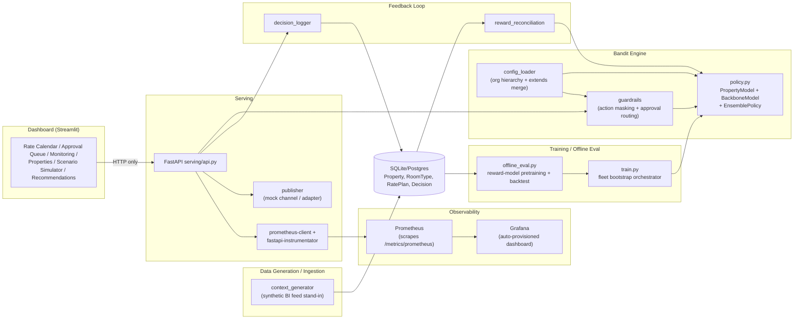
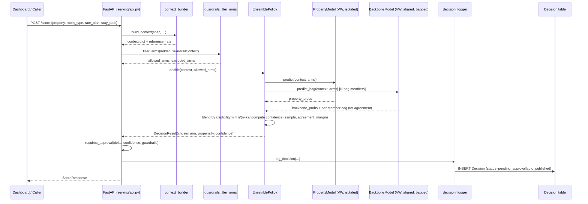
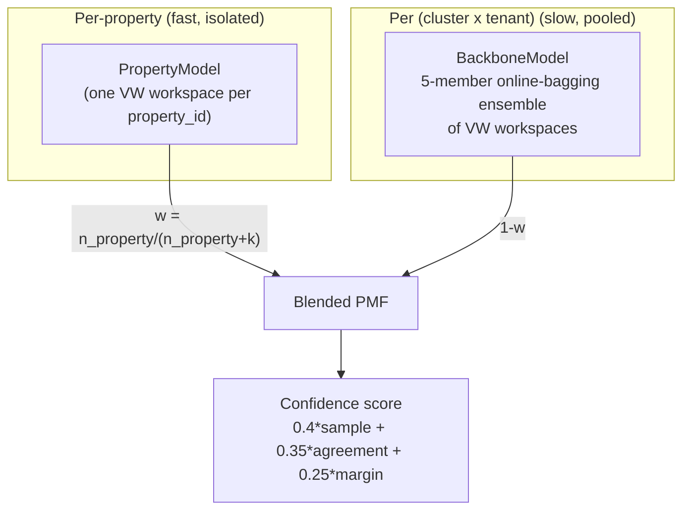
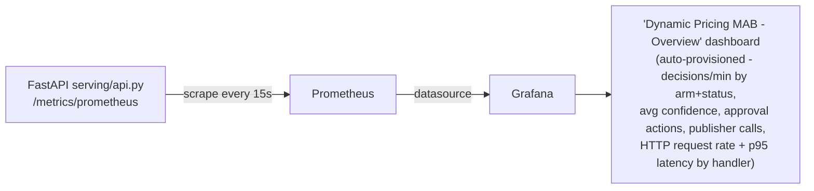
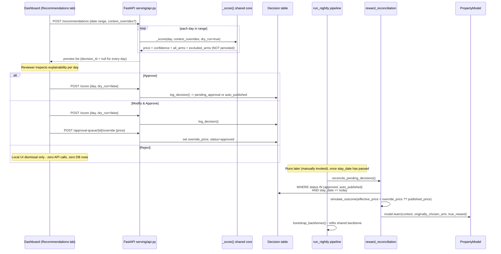

# Architecture: Dynamic Pricing Multi-Armed Bandit

## 1. Problem framing

Each (property, room_type, rate_plan, length-of-stay, stay_date) cell needs
a price recommendation, re-evaluated on a rolling cadence, that:
- Learns from booking outcomes (contextual bandit, not static rules)
- Respects hard guardrails (price bounds, comp-set positioning, change
  frequency, approval routing)
- Scales to 100k+ properties across many chains/regions without O(properties)
  operational burden or cross-tenant data leakage (antitrust exposure)
- Produces an auditable, explainable decision (arm + confidence + guardrail trace)

## 2. High-level architecture



## 3. Low-level: single decision request flow



## 4. Model architecture: ensemble blend (isolation + pooling)

Two orthogonal axes:

1. **Org/config hierarchy** (Chain -> Brand -> Region -> Property) for
   guardrail inheritance via `extends` deep-merge. Resolution order:
   Property > Region > Brand > Chain > Global.
2. **Market-cluster axis** (region x market-tier for the POC; comp-set-graph
   + KPI similarity in production) for statistical model **pooling**,
   scoped as `(cluster x tenant)` so competing chains sharing a cluster
   never share trained weights (antitrust / tenant isolation).



- `PropertyModel` updates online, immediately, from that property's own
  feedback only (physically separate object/file - hard isolation
  guarantee).
- `BackboneModel` updates only via scheduled batch retrain
  (`bandit_engine/training/train.py`), never from a single live event -
  so one property can never instantly leak into another's decisions.
- Credibility weight `k` (`ensemble.blend_smoothing_k`, per-tenant config)
  controls how fast a property "graduates" to trusting its own data;
  `k -> 0` is the full-independence opt-out for tenants who reject pooling
  entirely.

## 5. Confidence score

Composite of three components, each in [0,1], tenant-configurable weights
(default 0.4/0.35/0.25):
- **C_sample** = credibility weight `w` (how much property-specific data exists)
- **C_agreement** = 1 - normalized std-dev across the backbone's 5 bagged
  members' predicted probability for the chosen arm (low agreement = the
  pooled model itself is uncertain)
- **C_margin** = probability gap between the top-2 arms in the final blended PMF

Bucketed: Low (<0.4) / Medium (0.4-0.7) / High (>0.7). Used both for
dashboard display and for `requires_approval()` routing (low confidence OR
large price delta -> mandatory human approval).

## 6. Guardrails (action masking, not post-hoc rejection)

`guardrails/constraints.py` filters the arm ladder **before** the bandit
sees it - exploration never wastes probability mass on infeasible actions.
Rule registry: `price_bounds`, `competitive_positioning`,
`change_frequency` (throttles publish, not compute), `rate_parity`
(no-op by construction in this POC - one price per cell, no per-channel
differentiation to violate parity). Always guarantees at least the Base
Rate arm survives.

## 7. Offline pretraining / evaluation (see bandit_engine/training/)

Historical logs are **near-zero-exploration** by design (mirrors real
revenue-management systems: mostly a static baseline, with a small
heuristic-nudge fraction and a small full-ladder "pilot test" fraction -
see `context_generator/multi_chain_synthetic_data.py _pick_historical_arm`).
A naive off-policy replay using only the logged arm's importance weight
would be far too high-variance to learn anything about rarely-tried arms.

**Approach implemented for the POC** (`bandit_engine/training/offline_eval.py`):
1. Fit a gradient-boosted (XGBoost `XGBClassifier`) reward model,
   `P(booked) ~ context features + offset_pct`, with a NATIVE monotonic
   constraint (`monotone_constraints`) forcing the model's response to
   `offset_pct` to be non-increasing. No manual feature scaling needed -
   tree splits are scale-invariant. This replaced an earlier linear-
   regression + manually-clamped-coefficient approach (see "Reliability
   plan" below for why the switch happened and what it did/didn't fix).
2. **Premium elasticity floor** (`PREMIUM_ELASTICITY_FLOOR`): the native
   monotonic constraint only guarantees the *direction* of the P(booked)
   curve, not its *magnitude* - a too-mild fitted decline can still be
   mechanically dominated by the ladder's price growth, reproducing the
   same "always pick the highest price" failure the old linear model's
   floor was built to prevent. For `offset_pct > 0` (premium arms only),
   P(booked) is capped at a log-odds curve anchored at each context's own
   Base Rate (`offset_pct = 0`) prediction, declining at least
   `PREMIUM_ELASTICITY_FLOOR` per unit offset - this isn't optional
   polish, see "Reliability plan" below for the concrete regression it
   was added to fix.
3. **Distance-based shrinkage**: for arm offsets outside the range actually
   observed in the historical rows used to fit the model, the imputed
   reward is shrunk toward the model's prediction at the boundary of the
   observed range, proportional to how far past that boundary the arm is -
   bounding how much pure extrapolation is trusted for rarely/never-tried
   arms. In practice this ended up mostly inert on this dataset (the
   pilot-exploration fraction of historical logs already spans the full
   ladder), which is why the premium elasticity floor above was needed as
   a second, independent safety net.
4. **Doubly-robust correction at the logged arm**: for the one arm each
   historical row actually tried, the model's estimate is corrected toward
   the real observed outcome via inverse-propensity weighting (capped to
   bound variance), rather than trusting the model blindly even where real
   ground truth exists.
5. Held-out AUC/log-loss diagnostics are returned alongside the fitted
   model so callers can inspect/log fit quality (`train.py` reports
   `reward_model_auc` / `reward_model_reliable` per cluster x tenant).
6. Each **property's** bootstrap reuses its **cluster's** shared reward
   model rather than re-fitting on its own sparse (~150-400 row) sample -
   a single property's history is too thin to estimate price elasticity on
   its own.

This remains a pragmatic approximation of full doubly-robust off-policy
evaluation (real DR would apply the importance-weighted correction across
the whole logged-propensity distribution, not just at one arm) - documented
honestly as a model-based warm-start with explicit uncertainty handling,
not a rigorous unbiased estimator.

### Reliability plan - what was tried, what actually worked

The first version of this pipeline (no monotonicity floor, no shrinkage,
no DR correction, small history caps, unregularized reward model, per-
property reward-model refitting) trained a policy that **lost to the
static baseline on every property tested**, often catastrophically (up to
~40% of cumulative reward on luxury/wide-elasticity-spread clusters),
because the reward model - fit almost entirely on a ~±6.5% observed price
range - extrapolated a too-weak price-elasticity signal out to the ladder's
+62.5% tier, where the price multiplier's growth mechanically dominated a
too-mild predicted probability decline. The fixes below were added in this
order, each validated by re-running `run_backtest_suite`:

| Iteration | Mean (bandit - baseline) reward / 150 rounds | Diagnosis |
|---|---|---|
| Baseline (original, pre-fix) implementation | large negative on every property (e.g. -1611 on a single spot-check) | Reward model extrapolates a too-weak, noisy price coefficient; uniform-propensity imputation bakes it into training |
| + regularized/CV reward model, pilot-exploration logs, wider history caps, shared cluster model, shrinkage, DR correction, first monotonicity floor (`-0.8`) | -1534 mean, worst case -9867 (Miami luxury) | Floor of `-0.8` is signed correctly but far too *weak in magnitude* - a 62.5% price jump still mechanically outweighs the mild probability decline it implies, so the policy still collapses to "always pick the top tier" (confirmed via arm-distribution diagnostic: 400/400 rounds picked the most extreme arm) |
| + corrected monotonicity floor (`-2.0`, informed by commonly-cited hotel price-elasticity ranges of roughly -1 to -3 log-odds per 100% price change) on the linear reward model | -356 mean (all 30 properties within roughly -2% to -5% of baseline; no more catastrophic outliers) | Arm distribution now concentrates on Discount/Slight Discount - directionally sane, but still under-uses Premium/High Premium tiers the oracle sometimes prefers, and shows little differentiation across contexts (a linear coefficient can't capture non-linear price-elasticity interactions) |
| Switched the reward model from linear-regression + manually-clamped coefficient to an XGBoost `XGBClassifier` with a native `monotone_constraints=(-1,)` on `offset_pct` (see "Two-stage reward design" and `bandit_engine/training/offline_eval.py`), fleet trimmed to 2 chains x 6 properties for a clearer demo | **regressed to -5318.5 mean, 0/12 properties beating baseline** | `monotone_constraints` only guarantees the *direction* of the fitted P(booked) curve is non-increasing, not any *minimum rate* of decline. On this dataset the tree learned a too-mild, step-wise decline (e.g. 0.59 -> 0.39 across the whole ladder) that the ladder's ~2.56x price growth (cheapest to priciest arm) mechanically dominated - reproducing the exact "always pick the most extreme arm" failure mode the `-2.0` floor had fixed for the linear model, because the tree has no equivalent magnitude constraint and the existing distance-based shrinkage safety net turned out to be inert (the historical logs' pilot-exploration fraction already spans the *entire* ladder, so no arm is ever flagged as "out of the observed range") |
| Added `PREMIUM_ELASTICITY_FLOOR = -2.0`: for `offset_pct > 0` (premium arms only), P(booked) is capped at `sigmoid(logit(P(booked @ offset=0)) + PREMIUM_ELASTICITY_FLOOR * offset_pct)` - i.e. the same log-odds-per-unit-offset floor used for the linear model, but anchored at the tree's own context-specific Base Rate prediction instead of a single global coefficient | -151.8 mean, ci [-205.4, -99.5], 1/12 properties beating baseline | Restores the missing magnitude guarantee without discarding the tree's context-sensitivity: reward = P(booked) x price is now guaranteed to eventually decline as price rises, regardless of how mild the tree's own fitted slope is. This is a genuine improvement over the previous best (-356 mean) for the linear model, while keeping the GBM's non-linear context handling; discount-side arms are untouched (the floor is a no-op for `offset_pct <= 0`) since price shrinkage there can't produce the same runaway |
| Diagnosed the residual gap quantitatively: the historical-log mixture (`context_generator/multi_chain_synthetic_data.py _pick_historical_arm`) is 95% near-deterministic heuristic (85% Base Rate + 15% one adjacent tier) / 5% context-blind uniform "pilot test" (`PILOT_EXPLORATION_PROB`) - so each of the 7 non-adjacent ladder arms only ever got ~0.56% of rows, i.e. ~3 rows/property or ~17 rows/cluster, scattered randomly across the ENTIRE context space. Confirmed via an oracle-vs-bandit arm-distribution check on the collapsed property: the oracle's optimal arm actually spreads across 8 of 9 ladder arms for the same 150 contexts the bandit picked one arm for 150/150 times - ruling out "the collapse is actually oracle-matching" | (diagnosis only, no fix yet) | Root cause is a sampling-design bottleneck (too little context-conditioned signal at rarely-explored arms), not a modeling-algorithm bottleneck |
| Tested whether more **online** rounds alone (the property's fast `PropertyModel.learn` loop, already running every round inside `run_backtest`) close the gap, at n_rounds 150/300/600/1200/2000, without any bootstrap change | Loss grows **linearly** with rounds at a ~constant per-round rate (-1.01 to -0.93) under greedy (`explore=False`) evaluation - never shrinks; under `explore=True` the per-round rate gets progressively *worse* (-1.98 to -3.54) | Empirically ruled out as a fix: `explore=False` (the realistic low-exploration serving mode) means the policy only ever learns from the arm it already believes is best, so a collapsed bootstrap belief has no counterfactual signal to self-correct from - online learning cannot fix a bad bootstrap this way, within any practically observable horizon |
| Raised `PILOT_EXPLORATION_PROB` from 0.05 to 0.15 (~3x more context-scattered signal per extreme arm: ~1.67% of rows/arm instead of ~0.56%), regenerated data, retrained | -112.8 mean, ci [-174.4, -58.0], 3/12 properties beating baseline | Best result yet (a further ~26% cut in the mean gap, CI shifted meaningfully closer to zero, wins up from 1 to 3/12) - but the previously-flagged collapsed property (`hyatt_andaz_nyc_01`) is *still* 100% "Slight Discount" post-fix. Re-diagnosed via the credibility-weight formula (`w = n_observations/(n_observations+k)`): a freshly bootstrapped `PropertyModel` has `n_observations = 0` (by design, per the separate credibility-weight fix below), so `w = 0` and the ensemble blend is **100% backbone-driven** immediately post-bootstrap - meaning this property's collapse is actually the shared cluster **backbone**'s argmax not varying enough by context, not a property-level data-thinness issue as originally assumed |
| Diagnosed whether `PREMIUM_ELASTICITY_FLOOR` itself is suppressing legitimate premium-arm picks on the collapsed property/cluster: compared the reward model's RAW (unfloored) vs FLOORED argmax across the same 150 contexts | Floor binds on 502/750 (67%) of premium-arm evaluations; RAW argmax is more varied (4 distinct arms: Premium 58, Slight Discount 80, High Premium 7, Peak Premium 5) than FLOORED (~2 arms: Slight Discount 128, Base Rate 12) - but RAW matches the oracle's arm LESS often (24/150) than FLOORED does (34/150). Neither ever picks "Discount", the oracle's single most common choice (43/150) | Mixed/inconclusive result, not a clean "floor is bad" story: the floor is a large, active factor (binds most of the time) but disabling it doesn't clearly improve oracle-alignment - the underlying reward model's raw signal itself lacks resolution for several oracle-favored arms regardless of flooring, pointing back to the same data-scarcity root cause rather than the floor being the primary culprit for this property |
| Tried adding a numeric `offset_pct` feature to VW's own arm namespace (`bandit_engine/policy.py _arm_body`, alongside the existing categorical `arm_idx`/`arm_label` tokens), so `-q ca` would cross context features with the actual price value directly, not just arm identity - hypothesis: lets VW's own online fit generalize smoothly across arms instead of only inheriting whatever the offline reward model worked out per discrete arm | **Regressed sharply in aggregate: -736.8 mean, ci [-1431.0, -234.3]** - did fix the specific collapsed property (`hyatt_andaz_nyc_01` flipped from -28.0 to +57.7, a win) but caused severe new regressions elsewhere (`hyatt_andaz_la_01`: -305.7 -> -4725.4; `marriott_ritz_carlton_nyc_02`: +25.9 -> -1449.0) | **Reverted** - net negative despite fixing one property. Plausible cause: a continuous, fairly wide-magnitude feature (`offset_pct` up to 0.8125) crossed quadratically via `-q ca` without any feature scaling/normalization likely destabilized VW's per-context-feature weight updates for some clusters far more than it helped others - would need explicit scaling and/or a lower learning rate specifically for this feature before it could be tried safely again, not a same-day drop-in |

**Result**: as of this writing, GBM + premium elasticity floor + richer
pilot-exploration data (mean diff -112.8/150 rounds, CI [-174.4, -58.0]) is
the best result achieved so far - a ~3.2x improvement over the -356
linear-model baseline - but is **still not `reliably_beats_baseline`** (the
CI does not clear zero), and at least one property still shows a fully-
collapsed greedy arm distribution, understood to be a backbone-level (not
property-level) context-sensitivity limitation that is only partially,
ambiguously related to the premium elasticity floor (see diagnosis above).
Plausible next steps, not yet implemented: raising `PILOT_EXPLORATION_PROB`
further and/or raising `BACKBONE_HISTORY_CAP`/`PROPERTY_HISTORY_CAP`
(compounds with the pilot fraction rather than substituting for it),
per-arm (not just global-range) shrinkage informed by historical row
density per arm, richer context feature interactions in the reward model,
stratified (not context-blind uniform) pilot exploration, and/or retrying
the numeric-offset VW feature with explicit scaling/a lower learning rate
for that feature specifically. **Ruled out**: more *online* rounds alone
(tested, does not work under the current greedy-serving design - see
table above); a plain numeric `offset_pct` VW arm feature without scaling
(tested, net regression despite fixing one property - see table above).

**A second, separate bug found via the Scenario Simulator's what-if tool**:
every bootstrapped `PropertyModel` had `n_observations` equal to the full
bootstrap example count (e.g. 3600 = 400 rows x 9 arms), because
`PropertyModel.learn()` incremented it unconditionally, and
`bandit_engine/training/train.py`'s bootstrap loop called that same method.
Since the ensemble's credibility weight is `w = n_observations /
(n_observations + k)` (k=20 by default), this gave freshly-bootstrapped
properties `w ~= 0.994` - i.e. ~99.4% weight on the property's own
(sparsely-trained, single-property) model and ~0.6% on the shared cluster
backbone, *before a single real interaction had happened* - defeating the
entire point of the credibility-weighted blend, and (via the confidence
score's `C_sample = w` term) causing freshly-bootstrapped properties to
falsely report High confidence. Fixed by adding `count_as_observation:
bool = True` to `PropertyModel.learn()`; the bootstrap path now passes
`count_as_observation=False` (weights still get pretrained, but
`n_observations` - and therefore credibility/confidence - only grows from
real feedback: `EnsemblePolicy.record_feedback`,
`feedback/reward_reconciliation.py`, and backtest rounds, which
legitimately represent earned trust). Verified: post-fix, `n_observations`
is `0` and confidence dropped from a falsely-High 0.985 to an honest
Medium 0.5875 for an untouched property.

That fix is necessary but **not sufficient** to fix the "same arm
regardless of context" symptom on its own: re-testing the same low-demand
vs. high-demand override scenario post-fix (now correctly routed 100%
through the backbone) showed **identical** arm probabilities in both
cases - meaning the *backbone* model itself, not just the property-level
credibility bug, has the same weak-context-discrimination limitation
described above (unsurprising, since it's bootstrapped via the same
reward-model-imputation approach). In other words: the credibility-weight
fix corrects a real, independent bug (dishonest confidence reporting,
backbone starved of influence) but the underlying "does the model actually
react differently to different contexts" question still comes back to the
same open item - a richer/monotonic-constrained reward model and/or more
pretraining data.


`offline_eval.run_backtest(property_id, n_rounds, explore=False)` replays
held-out historical-style contexts, scoring three policies with the TRUE
ground-truth demand model as an oracle (never exposed to the bandit
itself): the trained bandit (evaluated **greedily** by default - matching
how a live system would serve the vast majority of non-exploration
traffic, so the backtest measures policy quality rather than conflating it
with the separately-budgeted cost of live exploration), the static
baseline, and the oracle optimum. Returns cumulative reward + a regret
curve for both bandit and baseline relative to the oracle.

`offline_eval.run_backtest_suite(property_ids, n_rounds)` runs the above
across many properties and computes a bootstrap confidence interval on the
mean (bandit - baseline) reward difference - `.reliably_beats_baseline` is
only `True` if that CI is entirely above zero. This (not a single
property/seed anecdote) is the intended accept/reject gate before
promoting a newly (re)trained model - see `tests/test_offline_eval.py` for
the accompanying deterministic unit tests (monotonicity-floor sanity check,
reward-model degenerate-data handling, doubly-robust correction direction).

**Known current limitation, honestly stated**: per the table above, the
bootstrap-trained bandit does not yet reliably beat the static baseline in
`run_backtest_suite` - it has gone from losing badly, to losing narrowly
with a linear reward model, to losing narrowly with a monotonic-constrained
GBM reward model, to losing narrowly-but-somewhat-less with richer pilot-
exploration data (current best: -112.8 mean, ci [-174.4, -58.0], 3/12
properties beating baseline). This is flagged as an open tuning item (see
"plausible next steps" above), not presented as solved.

## 8. Scalability plan (100k+ properties)

| Concern | POC approach | Production scaling approach |
|---|---|---|
| Model count | 1 PropertyModel/property + ~8-9 BackboneModels (cluster x tenant) | Same pattern; cluster count grows sub-linearly with property count (pooling is the point) |
| Training compute | Single-process `train.py`, in-memory VW workspaces | Per-cluster training jobs, horizontally parallel (K8s Jobs / Airflow DAG per cluster) |
| Storage | SQLite | Postgres (same SQLAlchemy code path via `DATABASE_URL`) |
| Model artifacts | Local filesystem (`model_registry/artifacts/`) | Object storage (S3/GCS) + `model_registry` metadata table, versioned |
| Data residency / blast radius | N/A (single region POC) | Cluster/backbone scoped per region; regional model-serving deployments; a region's retrain failure never touches another region's artifacts |
| Version skew | `schema_version` field on Property/Decision, additive-only changes | Same - consumers dispatch on schema_version, rolling deploys tolerate N/N-1 |
| Orchestration | Two plain Python scripts (`run_bootstrap.py`, `run_nightly.py`) | Airflow DAGs: one fleet-wide bootstrap DAG, one per-cluster nightly retrain DAG |
| Serving | Single FastAPI process | Horizontally scaled stateless API pods behind a load balancer; models loaded from object storage on pod start |

## 9. Two-stage reward design

- **Proxy reward**: `1.0` if booked else `0.0` - a binary flag, not a dollar
  amount (`context_generator/demand_model.py :: compute_rewards`).
- **True reward** (delayed): `price * (1 - channel_commission)` if the booking
  happened AND was not cancelled, otherwise `0.0`. Cancellation is a hard
  zero, not a scaling factor. Commission: direct 0%, OTA 15%. Computed by
  `feedback/reward_reconciliation.py` once the stay date has passed, and fed
  to `PropertyModel.learn` for that one property.

**Implementation status (audited against code).** Two defects were found in
this area and have since been fixed; one caveat remains.

- **FIXED - the backbone now learns from real outcomes.**
  `offline_eval._query_historical_rows` filters `is_historical == True`, i.e.
  the synthetic bootstrap dataset only, while live decisions are logged with
  `is_historical=False`. Reconciled outcomes were therefore excluded from
  training entirely. `offline_eval.query_reconciled_rows` +
  `build_examples_from_reconciled_rows` now replay them - using the arm that
  was actually played, its logged propensity, and the realized `true_reward` -
  and `bootstrap_backbones` appends them to the oracle-imputed batch. Ground
  truth is *added*, never substituted, so a fleet with no live feedback yet
  trains exactly as before.

- **FIXED - the nightly run no longer erases earned trust.**
  `run_nightly.py` step 2 called `bootstrap_properties()`, which constructed a
  fresh `PropertyModel(property_id)` and saved `n_observations = 0`. That
  overwrote the online updates applied by step 1 of the same run and reset the
  credibility weight `w = n / (n + k)` to zero every night, permanently
  pinning every property to its backbone. Step 2 now passes
  `only_missing=True`, so established properties are skipped and only
  newly onboarded ones get pretrained. Relatedly, a failed quality gate no
  longer rolls property models back - the gate evaluates backbones, and
  reverting property artifacts would discard reconciled learning it never
  tested.

- **CAVEAT - there is still no same-day loop.**
  `EnsemblePolicy.record_feedback` exists (`bandit_engine/policy.py`) but is
  called only from `tests/test_confidence.py`, never from `serving/api.py`.
  All learning is delayed until reconciliation. Consequently the proxy reward
  is never used as a learning signal at all - its only consumer is
  `offline_eval.py`, as the binary label for fitting the XGBoost reward model.

Regression coverage: `tests/test_nightly_learning_preservation.py`.

## 10. API-first dashboard design

The Streamlit dashboard (`dashboard/`) only ever calls the FastAPI serving
layer over HTTP (`dashboard/api_client.py`) - it never imports `db.*` or
`bandit_engine.*` directly. This keeps the dashboard swappable for a real
front-end (e.g. React) without touching business logic, and keeps a single
source of truth for guardrail/approval logic (the API), not duplicated
client-side.

Six tabs: **Rate Calendar** (filterable, confidence + arm explanation),
**Approval Queue** (approve/reject/override), **Monitoring** (arm
distribution, override rate, confidence, approval stats), **Properties**
(fleet browser), **Scenario Simulator** (`POST /simulate`, side-effect-free
what-if scoring - never logs a decision or affects training),
**Recommendations** (on-demand daily/weekly/monthly preview across a date
range via `POST /recommendations`, optional context overrides applied to
every day, then per-day Approve / Modify & Approve / Reject - see section
12 for the full data flow).

## 11. Observability (Prometheus + Grafana)

Two independent metrics surfaces, deliberately kept separate:

- `GET /metrics` (JSON) - fleet metrics computed from the `Decision` table
  (`monitoring/dashboard_metrics.py`): arm distribution, override rate,
  approval stats, average confidence. Consumed only by the Streamlit
  Monitoring tab.
- `GET /metrics/prometheus` (Prometheus text exposition) - HTTP-level
  metrics (`http_requests_total`, `http_request_duration_seconds`, etc.
  via `prometheus-fastapi-instrumentator`) plus 4 business counters/
  histograms declared in `serving/api.py`: `pricing_decisions_total`
  (kind/status/arm_label), `pricing_confidence_score` (histogram),
  `pricing_approval_actions_total` (action), `pricing_publisher_calls_total`
  (channel_ref). Scraped by Prometheus, visualized in Grafana.



Both Prometheus (`monitoring/prometheus.yml`) and Grafana
(`monitoring/grafana/provisioning/`, `monitoring/grafana/dashboards/`) are
fully pre-configured - no manual "add data source" or dashboard-import
click-through needed on first boot. See README.md step 10 for run
commands. `monitoring/prometheus.yml` lists both the manual-`podman run`
addressing (`host.containers.internal:8000`) and the compose-network
addressing (`api:8000`) as scrape targets in the same job, so one config
works either way (whichever isn't in use just shows as a harmless "down"
target).

## 12. On-demand recommendations, context overrides, and how they reach training

The **Recommendations** tab (`dashboard/tabs/recommendations.py`) and
`POST /recommendations` generate a daily/weekly/monthly/custom preview of
what the bandit would recommend across a date range - optionally with
manually overridden context (`context_overrides`, same allow-listed keys
as Scenario Simulator's what-if panel: occupancy, ADR trend, pace, pickup,
remaining inventory, comp set rate, event flag/intensity, segment),
applied identically to every day in the range.



Key properties of this flow, each independently important for correctness:

- **Preview is architecturally incapable of side effects** - `/recommendations`
  (default `persist=false`) and `/simulate` share the same `_score()` core
  as `/score` but that core never calls `log_decision`; there's no
  parameter to misconfigure that would accidentally persist a preview.
- **Reject is a dead end by design** - it's a client-side-only dismissal in
  the dashboard; nothing is ever sent to the API, so a rejected
  recommendation has zero footprint and zero chance of affecting training.
- **Override still credits the bandit's original arm choice** - reconciliation
  simulates the outcome against the human-adjusted price but attributes the
  learning update to the arm the bandit actually picked, keeping the
  online-learning signal honest (see `feedback/reward_reconciliation.py`).
- **Nothing is instantaneous** - reconciliation (and therefore any
  influence on `PropertyModel`/`BackboneModel` weights) only happens once
  the stay date has passed **and** `orchestration.pipelines.run_nightly`
  is explicitly run. There is no live/synchronous retraining path.

## 13. Model Versioning & Rollback

Model artifacts are now versioned with timestamps. Every `save()` call
(from `BackboneModel` or `PropertyModel`) creates a new version directory
rather than overwriting in place:

```
model_registry/artifacts/backbone/hyatt__nyc_luxury_urban/
    v_20260725_030000/    <-- timestamped version
        member_0.vw ... member_4.vw
    v_20260724_030000/    <-- previous version
    current.txt           <-- contains "v_20260725_030000"
```

- `current.txt` points to the active version; `load_or_create` always reads
  this pointer to find the right directory.
- **Rollback** = overwrite `current.txt` with a previous version tag.
  Implemented in `model_registry/versioning.py` (used by the quality gate
  in `run_nightly.py` when a retrain fails validation).
- **Pruning**: only the last 5 versions are kept; older ones are deleted
  automatically after each save.
- **Backward-compatible**: if no `current.txt` exists (legacy flat layout
  with `.vw` files directly in the base directory), the loader falls back
  to that layout transparently.

## 14. Quality Gate (automated model-promotion control)

The nightly pipeline (`orchestration/pipelines/run_nightly.py`) now
includes a mandatory quality gate:

```
┌─────────────────┐     ┌──────────────────┐     ┌─────────────────────┐
│ 1. Reconcile    │────▶│ 2. Retrain       │────▶│ 3. Quality Gate     │
│    rewards      │     │    (new version) │     │    (backtest suite) │
└─────────────────┘     └──────────────────┘     └────────┬────────────┘
                                                          │
                                              ┌───────────┴───────────┐
                                              │                       │
                                        ┌─────▼──────┐        ┌──────▼──────┐
                                        │ CI > 0?    │        │ CI ≤ 0?     │
                                        │ PROMOTE    │        │ ROLLBACK    │
                                        │ (keep new) │        │ + ALERT     │
                                        └────────────┘        └─────────────┘
```

- After retraining, `run_backtest_suite` is run on a sample of 6 properties.
- If `reliably_beats_baseline` is True (bootstrap CI entirely above zero):
  the new model stays as `current` (already promoted by versioning).
- If False: ALL backbone and property models are rolled back to their
  previous version, and a warning is logged. The system continues serving
  the prior (known-better) model.
- The gate is configurable: `QUALITY_GATE_ENABLED = True/False`,
  `BACKTEST_SAMPLE_SIZE`, `BACKTEST_N_ROUNDS`.

## 15. Kill-Switch / Fallback Mode

A config-driven scoring mode (`config/tenants/_defaults.yaml` or per-tenant
override) controls whether the bandit is active:

| Mode | Behavior | When to use |
|---|---|---|
| `bandit` | Normal MAB scoring (default) | Production, bandit validated |
| `baseline` | Bypass bandit, always return Base Rate (0% offset) | Emergency kill-switch, model degradation detected |
| `shadow` | Score bandit normally, but publish baseline; log both for comparison | Pre-production A/B validation |

Configured via `scoring_mode:` in tenant YAML. The API resolves this via
`bandit_engine/config_loader.resolve_scoring_mode(tenant_id)` and acts
accordingly in `serving/api.py _score()`.

API endpoint: `GET /scoring-mode/{tenant_id}` returns the current mode.

## 16. Shadow Mode (live A/B validation)

When `scoring_mode: shadow`:

1. The bandit scores the context normally (full ensemble, guardrails, etc.)
2. The bandit's recommendation (arm, price, confidence) is preserved in
   `confidence_breakdown` for later analysis
3. The **published response** is overridden to the baseline (Base Rate arm)
4. The decision is logged with the baseline price (what the guest actually sees)
5. Revenue managers can later compare "what the bandit would have done" vs.
   "what was actually published" using real booking outcomes

This enables zero-risk live validation: the bandit never touches guests,
but you accumulate real evidence of whether its recommendations would have
been better. After 2-4 weeks of shadow data, switch to `scoring_mode: bandit`
if the evidence is positive.

## 17. Reward Model Improvements (context-dependent elasticity)

The offline reward model (`bandit_engine/training/offline_eval.py`) now
includes:

1. **Context-offset interaction features**: `occupancy_pct * offset_pct`,
   `event_intensity * offset_pct`, `pace_vs_stly_pct * offset_pct`,
   `pickup_last_7d * offset_pct`, and `segment_elasticity * offset_pct`.
   These help the XGBoost model learn "high occupancy makes premium arms
   more viable" without needing to discover these splits from sparse data.

2. **Context-conditioned premium elasticity floor**: instead of a single
   global `PREMIUM_ELASTICITY_FLOOR = -2.0` for all segments, the floor
   now varies by guest segment:
   - Corporate: -1.3 (least elastic, tolerates higher prices)
   - Group: -1.6
   - Transient: -2.0 (the old global default)
   - Leisure: -2.6 (most elastic, penalizes premiums more)

3. **Higher history caps**: `BACKBONE_HISTORY_CAP` raised from 3000 to 8000,
   `PROPERTY_HISTORY_CAP` from 600 to 1500 — gives the reward model and
   VW more signal to work with.

## 18. Model Health Endpoint

`GET /model/health` returns:
- Per-backbone version info (how many versions exist, which is current)
- Number of property models deployed
- Whether model versioning and quality gate are enabled

This serves as the "proof of credibility" endpoint for external stakeholders
and dashboards.

## 19. Deployment (podman-compose)

The full stack runs via `podman-compose up` (or `docker compose up`):

```
┌──────────────┐   ┌──────────┐   ┌─────────────┐   ┌────────────┐   ┌─────────┐
│  bootstrap   │──▶│   api    │──▶│  dashboard  │   │ prometheus │──▶│ grafana │
│ (runs once,  │   │ :8000    │   │   :8501     │   │   :9090    │   │  :3000  │
│  generates   │   │          │   │             │   │            │   │         │
│  data+models)│   │          │   │             │   │            │   │         │
└──────────────┘   └──────────┘   └─────────────┘   └────────────┘   └─────────┘
       │                │                │
       └────────┬───────┘                │
          pricing-data              (scrapes api)
          volume (SQLite)
```

**Podman on Windows workaround**: `podman-compose` has a known bug where it
doesn't honor the `dockerfile:` field. The fix:
1. Run `.\scripts\build-images.ps1` first (pre-builds all images with
   explicit `-f` flags, which podman handles correctly)
2. Then `podman-compose up` finds images by `image: localhost/...` name

**Local development** (no containers):
1. `.\scripts\bootstrap-local.ps1` — generates data + trains models
2. `uvicorn serving.api:app --host 0.0.0.0 --port 8000`
3. `python -m streamlit run dashboard/app.py`
