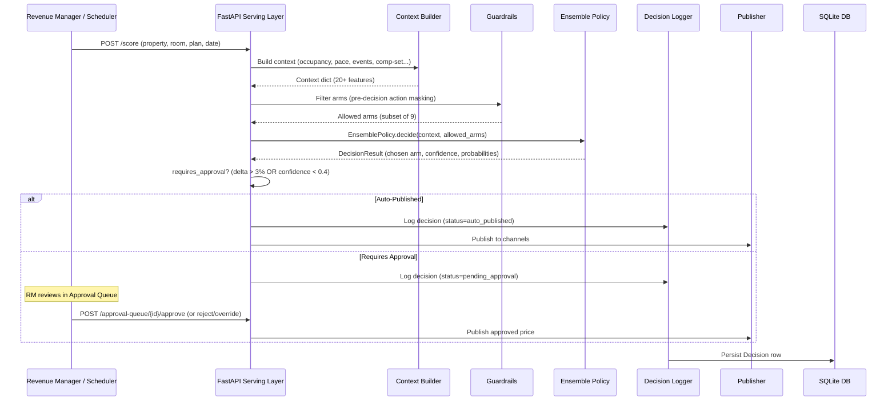

# 01 - High-Level System Architecture

## Overview

The Dynamic Pricing MAB (Multi-Armed Bandit) system is an AI-driven hotel rate optimization platform. It learns optimal price adjustments for each property/room/rate-plan combination by treating pricing as a contextual bandit problem - choosing from a discrete set of percentage offsets applied on top of a reference rate, then learning from realized booking outcomes.

```
+-----------------------------------------------------------------------------------+
|                              DYNAMIC PRICING MAB                                   |
|                                                                                    |
|  +-----------+     +----------------+     +-----------+     +----------------+    |
|  |  Config   |---->|  Bandit Engine |---->| Guardrails|---->|  Serving API   |    |
|  |  (YAML)   |     | (VW CB_ADF)   |     | (Masking) |     |  (FastAPI)     |    |
|  +-----------+     +----------------+     +-----------+     +----------------+    |
|       |                   ^    |                                  |    |           |
|       v                   |    v                                  v    v           |
|  +-----------+     +------+--------+     +----------------+  +--------+------+   |
|  | Clusters  |     |   Training    |     |   Publisher    |  | Frontend UI   |   |
|  | & Tenants |     |   Pipeline    |     | (Channels)    |  | (HTML/JS)     |   |
|  +-----------+     +---------------+     +----------------+  +---------------+   |
|                           ^                                        |              |
|                           |                                        v              |
|  +-----------+     +------+--------+     +----------------+  +---------------+   |
|  |  Context  |     |   Feedback    |     |  Monitoring   |  | Revenue Mgr   |   |
|  | Generator |     | & Rewards     |     | (Prometheus/  |  | (Approve/     |   |
|  +-----------+     +---------------+     |  Grafana)     |  |  Reject/      |   |
|                                          +----------------+  |  Override)    |   |
|                                                              +---------------+   |
+-----------------------------------------------------------------------------------+
```

## Core Concept: Price = ReferenceRate x (1 + arm_offset_pct)

The system does NOT set absolute prices. Instead:

1. A **Reference Rate** is computed from: `BAR x RoomTypeMultiplier x RatePlanOffset x LOSCurve`
2. The bandit selects an **arm** (one of 9 discrete percentage offsets from -22.5% to +62.5%)
3. The final published price = `ReferenceRate x (1 + chosen_offset)`

This separation means the bandit only needs to learn market-condition-appropriate *adjustments*, not absolute price levels.

## System Flow (Request Lifecycle)



## Key Architectural Decisions

| Decision | Rationale |
|----------|-----------|
| Contextual Bandit (not RL/MDP) | Stateless decisions per (property, date) cell. No need to model sequential state transitions for hotel pricing. |
| Vowpal Wabbit CB_ADF | Proven, lightweight, supports online learning. Action-dependent features allow arm-specific context. |
| Two-tier model (Backbone + Property) | Solves the cold-start problem. New properties borrow strength from their cluster until they earn their own data. |
| Config-driven guardrails | Business rules change frequently. YAML-first design means revenue managers don't need code changes. |
| Pre-decision action masking | Infeasible arms are removed BEFORE the bandit sees them, so exploration never wastes probability on impossible actions. |
| Approval routing | Large deltas or low confidence automatically route to human review, providing a safety net. |

## Services (Deployment Topology)

```
+-------------------+       +-------------------+       +-------------------+
|    Bootstrap      |       |    API + UI       |       |   Prometheus      |
| (one-time init)   |------>|  (FastAPI on      |<------|   (scrapes        |
| - Generate data   |       |   port 8000)      |       |   /metrics/prom)  |
| - Train models    |       | - REST endpoints  |       +-------------------+
| - Exit on success |       | - Static frontend |               |
+-------------------+       | - SSE events      |               v
                            +-------------------+       +-------------------+
                                                        |     Grafana       |
                                                        |  (dashboards on   |
                                                        |   port 3000)      |
                                                        +-------------------+
```

| Service | Port | Purpose |
|---------|------|---------|
| API | 8000 | REST API + static dashboard UI + SSE real-time events |
| Prometheus | 9090 | Metric collection (scrapes API's `/metrics/prometheus`) |
| Grafana | 3000 | Visual dashboards for fleet-wide monitoring |

## Data Flow Summary

```
                    OFFLINE (Bootstrap / Nightly)
                    ============================
    Synthetic Data ──> Reward Model (XGBoost) ──> Augmented Examples ──> VW Train
                                                                            |
                                                                            v
                                                                    Model Artifacts
                                                                    (versioned dirs)
                                                                            |
                    ONLINE (Live Scoring)                                    |
                    ====================                                    |
    Context Signals ──> Guardrail Filter ──> EnsemblePolicy.decide() <──────┘
                                                    |
                                                    v
                                        Decision (arm + confidence)
                                                    |
                            ┌───────────────────────┼──────────────────────┐
                            v                       v                      v
                    Auto-Publish            Pending Approval         Dry-Run (Sim)
                            |                       |                      |
                            v                       v                      |
                    Publisher (channels)     RM Approve/Reject/Override     |
                            |                       |                      |
                            └───────────┬───────────┘                      |
                                        v                                  |
                    FEEDBACK (Post-Stay Reconciliation)                     |
                    ====================================                    |
                    Stay date passes ──> Simulate outcome ──> true_reward   |
                                                                |          |
                                                                v          |
                                                    PropertyModel.learn()  |
                                                    (online weight update) |
                                                                           |
                                                                     (no learning)
```

## Technology Stack

| Layer | Technology |
|-------|-----------|
| Bandit Engine | Vowpal Wabbit (CB_ADF with explore-first) |
| Reward Model | XGBoost (monotonic-constrained gradient-boosted classifier) |
| API | FastAPI + Uvicorn |
| Database | SQLite (POC; swappable to PostgreSQL) |
| Config | YAML with deep-merge inheritance |
| Frontend | HTML + Bootstrap 5 + vanilla JS |
| Monitoring | Prometheus + Grafana (auto-provisioned) |
| Containers | Podman/Docker Compose |
| Orchestration | Python scripts (POC substitute for Airflow) |

## Scoring Modes (Safety)

The system supports three scoring modes configurable per-tenant:

| Mode | Behavior | Use Case |
|------|----------|----------|
| `bandit` | Normal MAB scoring + publish | Default operation |
| `baseline` | Always returns Base Rate (0% offset) | Kill-switch / emergency fallback |
| `shadow` | Score bandit + baseline, log both, publish baseline only | A/B comparison without risk |

## Next: Detailed Components

See [02-LOW-LEVEL-COMPONENTS.md](./02-LOW-LEVEL-COMPONENTS.md) for a deep dive into each module.
