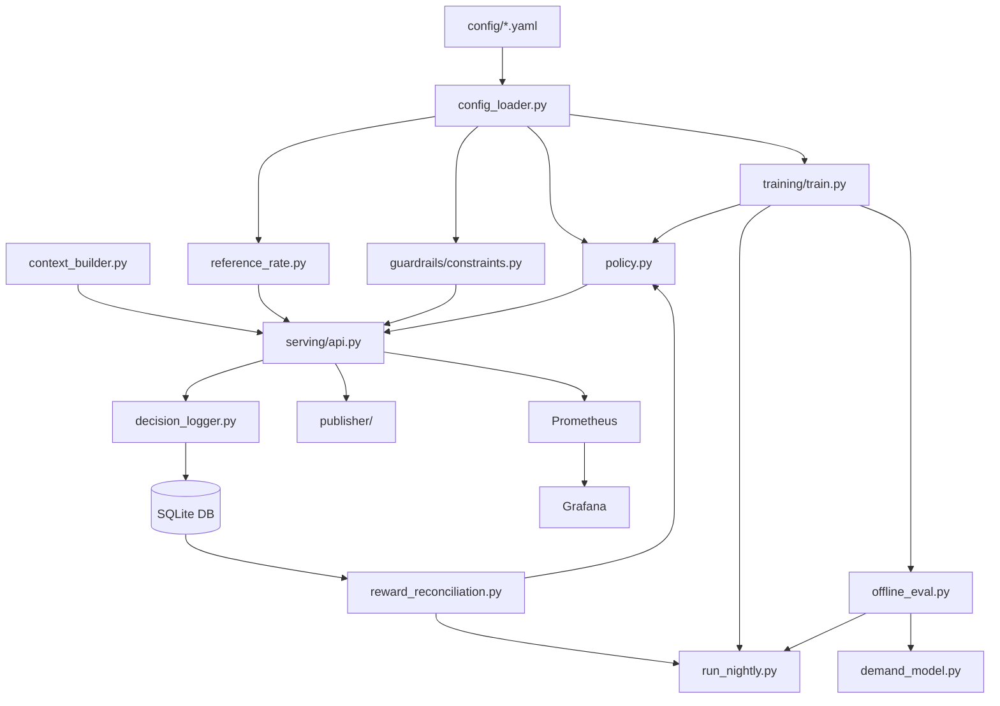

# 02 - Low-Level Component Architecture

## Component Map

```
d:\Work\MAB\dynamic-pricing-mab\
├── bandit_engine/            # Core ML: policy, training, config, reference rate
│   ├── policy.py             # BackboneModel, PropertyModel, EnsemblePolicy
│   ├── config_loader.py      # YAML loading + deep-merge extends mechanism
│   ├── reference_rate.py     # BAR x multipliers composition
│   └── training/
│       ├── train.py          # Fleet bootstrap + retrain orchestrator
│       └── offline_eval.py   # Reward model (XGBoost), backtest suite
├── config/                   # All business config (YAML-first, no code changes)
│   ├── arms.yaml             # 9-arm ladder definition
│   ├── clusters.yaml         # Market cluster definitions
│   ├── context_schema.yaml   # Feature schema
│   ├── guardrails.yaml       # Global guardrail rules
│   └── tenants/              # Per-tenant config (extends _defaults)
├── context_generator/        # Synthetic data + context assembly
│   ├── context_builder.py    # Live context assembly (20+ features)
│   ├── chains.py             # PropertySpec data class + tenant hierarchy
│   ├── demand_model.py       # Ground-truth demand oracle (testing only)
│   └── multi_chain_synthetic_data.py  # Fleet-wide data generation
├── feedback/                 # Decision logging + delayed reward reconciliation
│   ├── decision_logger.py    # Append-only decision persistence
│   └── reward_reconciliation.py  # Post-stay outcome → online learning
├── guardrails/               # Pre-decision action masking
│   └── constraints.py        # Rule registry + filter_arms()
├── model_registry/           # Artifact management
│   ├── registry.py           # List/inspect model artifacts
│   └── versioning.py         # Timestamped versions + rollback
├── monitoring/               # Observability
│   ├── dashboard_metrics.py  # Fleet KPIs (arm distribution, override rate)
│   ├── prometheus.yml        # Scrape config
│   └── grafana/              # Auto-provisioned dashboards
├── orchestration/pipelines/  # Batch jobs (bootstrap, nightly retrain)
├── publisher/                # Channel publish abstraction
├── serving/                  # FastAPI layer + static frontend
│   ├── api.py                # All REST endpoints + SSE + static mount
│   └── schemas.py            # Pydantic request/response models
└── frontend/                 # Static HTML/JS/CSS dashboard
```

---

## 1. Bandit Engine (`bandit_engine/`)

The heart of the system. Contains the contextual bandit policy, model architecture, and training logic.

### 1.1 Policy (`policy.py`)

```
┌─────────────────────────────────────────────────────────────────────┐
│                        EnsemblePolicy                                │
│                                                                     │
│  ┌──────────────────────┐    ┌──────────────────────────────────┐  │
│  │    PropertyModel     │    │        BackboneModel              │  │
│  │  (1 per property)    │    │  (1 per cluster x tenant)        │  │
│  │                      │    │                                  │  │
│  │  - Single VW workspace│    │  - 5 VW workspaces (bag)        │  │
│  │  - Fast online update │    │  - Batch-only update            │  │
│  │  - Isolated weights   │    │  - Poisson(1) online-bagging    │  │
│  │  - n_observations     │    │  - Per-member predictions       │  │
│  │    tracker            │    │    (for confidence/agreement)    │  │
│  └──────────┬───────────┘    └──────────────┬───────────────────┘  │
│             │                                │                      │
│             │    Credibility Blend           │                      │
│             │    w = n / (n + k)             │                      │
│             │                                │                      │
│             v                                v                      │
│  ┌──────────────────────────────────────────────────────────────┐  │
│  │  blended_prob[i] = w * property_prob[i] + (1-w) * backbone[i]│  │
│  └──────────────────────────────────────────────────────────────┘  │
│                              │                                      │
│                              v                                      │
│  ┌──────────────────────────────────────────────────────────────┐  │
│  │  Confidence Score = weighted(sample, agreement, margin)       │  │
│  │    sample    = sigmoid(n_observations, k)    [weight: 0.4]    │  │
│  │    agreement = 1 - std_dev(bag_member_probs) [weight: 0.35]   │  │
│  │    margin    = gap(top_arm - 2nd_arm)        [weight: 0.25]   │  │
│  └──────────────────────────────────────────────────────────────┘  │
│                              │                                      │
│                              v                                      │
│                      DecisionResult                                 │
│                  (chosen_arm, propensity,                            │
│                   confidence, all_arm_probs)                         │
└─────────────────────────────────────────────────────────────────────┘
```

**Key classes:**

| Class | Scope | Update Mode | File Location |
|-------|-------|-------------|---------------|
| `BackboneModel` | 1 per (cluster_id, tenant_id) | Batch only (nightly retrain) | `model_registry/artifacts/backbone/{tenant}__{cluster}/` |
| `PropertyModel` | 1 per property_id | Online (each reconciled decision) | `model_registry/artifacts/property/{property_id}/` |
| `EnsemblePolicy` | Combines both for scoring | Read-only (blends at query time) | In-memory per request |

**VW Configuration:**
```
--cb_explore_adf -q ca --quiet --learning_rate 0.5 --random_seed {seed}
```
- `cb_explore_adf`: Contextual Bandit with Action-Dependent Features
- `-q ca`: Quadratic interactions between context (`c`) and arm (`a`) namespaces
- Online-bagging with 5 members (backbone) for uncertainty estimation

### 1.2 Config Loader (`config_loader.py`)

Implements the deep-merge inheritance system:

```
Resolution Order (child wins on conflict):
    Property > Region > Brand > Chain > _defaults.yaml > guardrails.yaml

                   ┌────────────────────┐
                   │  guardrails.yaml   │  (global platform defaults)
                   └─────────┬──────────┘
                             │ extends
                   ┌─────────v──────────┐
                   │  _defaults.yaml    │  (shared tenant defaults)
                   └─────────┬──────────┘
                             │ extends
              ┌──────────────┼──────────────┐
              v                             v
   ┌──────────────────┐         ┌──────────────────┐
   │  marriott.yaml   │         │   hyatt.yaml     │
   │  (no overrides)  │         │  (tighter comp   │
   │                  │         │   positioning)   │
   └──────────────────┘         └──────────────────┘
```

**Key functions:**
- `load_tenant_config(tenant_id)` - Loads with `extends` chain resolution
- `resolve_guardrails_for_tenant(tenant_id)` - Global + tenant overrides merged
- `resolve_arm_ladder_for_cluster(cluster_id)` - Default ladder x elasticity_spread
- `resolve_scoring_mode(tenant_id)` - bandit / baseline / shadow

### 1.3 Reference Rate (`reference_rate.py`)

```
ReferenceRate = BAR(property) x RoomType(multiplier) x RatePlan(offset) x LOS(curve)

Example:
  BAR = $200 (property's base best-available-rate)
  Room = "suite" → x1.50
  Plan = "senior" → x0.85
  LOS  = "3-5 nights" → x0.95

  ReferenceRate = $200 x 1.50 x 0.85 x 0.95 = $242.25

  If bandit picks "Slight Premium" (+6.5%):
  Published Price = $242.25 x 1.065 = $257.99
```

**Rate plan exclusion:** `corporate_negotiated` has `bandit_managed: false` - contractual/fixed rates are entirely excluded from the bandit's action space.

### 1.4 Training (`training/train.py`)

Orchestrates fleet-wide model training:

```
bootstrap_all()
    ├── bootstrap_backbones()
    │   ├── For each (cluster_id, tenant_id) pair:
    │   │   ├── Fit cluster-level reward model (shared XGBoost)
    │   │   ├── Generate augmented training examples (oracle-based)
    │   │   ├── BackboneModel.learn_batch(examples) [3 passes]
    │   │   └── BackboneModel.save() [versioned]
    │   └── Return reward_model_cache (shared across properties)
    │
    └── bootstrap_properties(reward_model_cache)
        └── For each property:
            ├── Query property-specific historical rows
            ├── Reuse cluster's reward model (not re-fitted per property)
            ├── Generate augmented examples
            ├── PropertyModel.learn(count_as_observation=False) per example
            └── PropertyModel.save() [versioned]
```

### 1.5 Offline Evaluation (`training/offline_eval.py`)

Two distinct roles:

**A) Reward Model (XGBoost)** - Used for training signal generation:
- Fits `P(booked) ~ context_features + offset_pct`
- Monotonic constraint: raising price can NEVER increase booking probability
- Context-conditioned premium elasticity floor per segment
- Doubly-robust correction at the logged arm
- Interaction features: `occupancy*offset`, `event*offset`, `segment_elasticity*offset`

**B) Backtest Suite** - Used for quality gate validation:
- Uses the TRUE oracle demand model (never exposed to the bandit)
- Compares trained policy vs static baseline over N rounds
- Returns bootstrap CI: if CI_low > 0, the model reliably beats baseline
- Drives the nightly retrain promote/rollback decision

---

## 2. Configuration (`config/`)

### 2.1 Arms (`arms.yaml`)

9-tier asymmetric ladder:

```
Index  Label              Offset     Typical Trigger
─────  ─────────────────  ─────────  ─────────────────────────────────────
  0    Deep Discount      -22.5%     Low season, far behind pace target
  1    Discount           -15.0%     Weak demand, behind budget
  2    Slight Discount     -6.5%     Moderate softness, fill inventory
  3    Base Rate            0.0%     Normal market conditions
  4    Slight Premium      +6.5%     Moderate demand, slight comp advantage
  5    Premium            +15.0%     Strong demand, weekend, conference
  6    High Premium       +27.5%     High occupancy + high demand index
  7    Demand Surge       +45.0%     Major event, high pickup, nearly sold-out
  8    Peak Premium       +62.5%     Exceptional demand, all signals at max
```

**Cluster scaling:** Each cluster has an `elasticity_spread` factor (default 1.0). Luxury clusters use 1.3x (wider ladder - guests are less price-sensitive).

### 2.2 Clusters (`clusters.yaml`)

```yaml
clusters:
  - id: nyc_midscale_urban       # region x market_tier
    elasticity_spread: 1.0
  - id: nyc_luxury_urban
    elasticity_spread: 1.3       # wider ladder for luxury
  - id: chicago_midscale_urban
    elasticity_spread: 1.0
  # ...

sizing:
  target_min_properties_per_cluster: 3
  target_max_properties_per_cluster: 500
```

### 2.3 Guardrails (`guardrails.yaml`)

```yaml
price_bounds:
  min_offset_pct: -0.225         # cannot exceed ladder bounds
  max_offset_pct: 0.625

competitive_positioning:
  min_index_vs_compset: 0.75     # never price below 75% of comp-set avg
  max_index_vs_compset: 1.60     # never price above 160% of comp-set avg

change_frequency:
  max_changes_per_day: 2         # throttles publishing, not scoring

approval:
  auto_publish_delta_threshold_pct: 0.03    # |delta| > 3% → approval needed
  require_approval_if_confidence_below: 0.4  # low confidence → always review
```

---

## 3. Context Generator (`context_generator/`)

### 3.1 Context Builder (`context_builder.py`)

Assembles a 20+ feature context dict for each scoring request:

```
┌─────────────────────────────────────────────────────────────────┐
│                    Context Features                               │
├─────────────────────────────────────────────────────────────────┤
│ DEMAND SIGNALS         │ COMP-SET SIGNALS        │ CALENDAR     │
│ ─────────────────────  │ ────────────────────── │ ──────────── │
│ occupancy_pct          │ comp_set_avg_rate       │ day_of_week  │
│ adr_trend_pct          │ our_rate_vs_compset     │ lead_time    │
│ pace_vs_stly_pct       │ compset_rate_trend_pct  │              │
│ pickup_last_7d         │ compset_rank            │              │
│ remaining_inventory_pct│ compset_dispersion      │              │
├─────────────────────────────────────────────────────────────────┤
│ EVENTS                 │ SEGMENTATION            │ IDENTITY     │
│ ─────────────────────  │ ────────────────────── │ ──────────── │
│ event_flag             │ segment (transient/     │ property_id  │
│ event_intensity (0-1)  │   corporate/group/      │ cluster_id   │
│                        │   leisure)              │ tenant_id    │
│                        │ room_type               │              │
│                        │ rate_plan               │              │
│                        │ los_bucket              │              │
└─────────────────────────────────────────────────────────────────┘
```

**Correlations are built-in:** Events boost occupancy. High occupancy drives positive pace. Pace drives pickup. Comp-set reacts to the same market conditions. This ensures synthetic data is realistic (signals don't contradict each other).

### 3.2 Demand Model (`demand_model.py`)

The ground-truth oracle (NEVER exposed to the bandit in production):
- `booking_probability(context, offset_pct, rate_plan)` - True P(booked)
- `cancellation_probability(...)` - P(cancel | booked)
- Used only for: (a) generating synthetic historical outcomes, (b) backtest quality gate

---

## 4. Guardrails (`guardrails/constraints.py`)

Pre-decision action masking via a rule registry:

```
┌───────────────┐     ┌──────────────────────────────────┐
│  Full Ladder  │────>│          RULE REGISTRY            │
│  (9 arms)     │     │                                  │
└───────────────┘     │  1. rule_price_bounds             │
                      │  2. rule_competitive_positioning   │
                      │  3. rule_change_frequency          │
                      │  4. rule_rate_parity (placeholder) │
                      │                                  │
                      │  For each arm × each rule:       │
                      │    violation? → ExcludedArm       │
                      └──────────────┬───────────────────┘
                                     │
                      ┌──────────────v───────────────────┐
                      │  Allowed Arms (typically 5-8)    │
                      │  (always includes Base Rate 0%)  │
                      └──────────────────────────────────┘
```

**Safety guarantee:** If ALL arms would be excluded, the Base Rate (0% offset) is always preserved. The system never has zero feasible actions.

---

## 5. Feedback & Rewards (`feedback/`)

### 5.1 Decision Logger (`decision_logger.py`)

- Append-only: every decision gets a UUID, persisted immediately
- `supersede_prior_decisions()`: marks old decisions for the same (property, room, plan, date) cell
- `is_dry_run=True`: Scenario Simulator decisions are NEVER mixed into training data

### 5.2 Reward Reconciliation (`reward_reconciliation.py`)

Post-stay processing:
1. Finds decisions where `stay_date <= today` AND `reconciled_at IS NULL`
2. Only reconciles `approved` or `auto_published` decisions (never rejected/pending)
3. Simulates realized outcome (booked? cancelled? channel?)
4. Computes `true_reward = price * booked * (1 - cancellation) * (1 - commission)`
5. Calls `PropertyModel.learn()` with the true reward (online weight update)
6. Saves updated model

---

## 6. Model Registry (`model_registry/`)

### 6.1 Versioning (`versioning.py`)

```
model_registry/artifacts/
├── backbone/
│   ├── marriott__nyc_midscale_urban/
│   │   ├── current.txt              → "v_20240615_120000"
│   │   ├── v_20240614_120000/       (previous version)
│   │   │   ├── member_0.vw
│   │   │   ├── member_1.vw
│   │   │   └── ... (5 members)
│   │   └── v_20240615_120000/       (current version)
│   │       └── member_0.vw ... member_4.vw
│   └── hyatt__nyc_luxury_urban/
│       └── ...
└── property/
    ├── marriott_courtyard_nyc_1/
    │   ├── current.txt              → "v_20240615_120000"
    │   └── v_20240615_120000/
    │       ├── model.vw
    │       └── n_observations.txt
    └── ...
```

- **Rollback:** Overwrite `current.txt` with a previous version tag
- **Pruning:** Keeps last 5 versions, deletes older ones
- **Backward compat:** If no `current.txt` exists, falls back to legacy flat layout

---

## 7. Serving (`serving/api.py`)

### Endpoint Map

| Method | Path | Purpose | Side Effects |
|--------|------|---------|-------------|
| GET | `/properties` | List all properties | None |
| GET | `/properties/{id}/config` | Room types + rate plans for a property | None |
| POST | `/score` | Live pricing decision | Writes Decision, may publish |
| POST | `/simulate` | Dry-run (Scenario Simulator) | None |
| POST | `/recommendations` | Date-range batch scoring | Optional persist |
| GET | `/rate-calendar` | Latest decisions per cell | None |
| GET | `/approval-queue` | Pending-approval decisions | None |
| POST | `/approval-queue/{id}/approve` | Approve a pending decision | Updates status, publishes |
| POST | `/approval-queue/{id}/reject` | Reject a pending decision | Updates status |
| POST | `/approval-queue/{id}/override` | Override with a custom price | Updates status, publishes override |
| GET | `/storefront/{property_id}` | Live prices (for OTA/brand site) | None |
| GET | `/metrics` | JSON fleet metrics | None |
| GET | `/metrics/prometheus` | Prometheus scrape endpoint | None |
| GET | `/events` | SSE stream for real-time UI updates | None |
| GET | `/dashboard` | Serves static HTML frontend | None |

### Prometheus Metrics Exported

| Metric | Type | Labels |
|--------|------|--------|
| `pricing_decisions_total` | Counter | kind, status, arm_label |
| `pricing_confidence_score` | Histogram | - |
| `pricing_scoring_duration_seconds` | Histogram | - |
| `pricing_arm_offset_pct` | Histogram | - |
| `pricing_guardrail_exclusions_total` | Counter | rule |
| `pricing_decisions_by_tenant_total` | Counter | tenant_id, arm_label |
| `pricing_decisions_by_cluster_total` | Counter | cluster_id, arm_label |
| `pricing_approval_actions_total` | Counter | action |
| `pricing_publisher_calls_total` | Counter | channel_ref |

---

## 8. Publisher (`publisher/`)

Abstract interface (`BasePublisher`) with a POC mock implementation:

```python
class MockChannelPublisher(BasePublisher):
    def publish(property_id, room_type, rate_plan, stay_date, price) -> dict:
        # Logs to: direct_website, gds_mock, ota_mock
        # Same price for all channels = rate parity by construction
```

In production, this is replaced by a real channel-manager adapter (SiteMinder, Synxis, etc.) without changing any calling code.

---

## 9. Monitoring (`monitoring/`)

```
┌───────────┐   scrape /metrics/prometheus   ┌──────────────┐   data source   ┌─────────┐
│  FastAPI  │ ─────────────────────────────> │  Prometheus  │ ──────────────> │ Grafana │
│  (8000)   │                                │   (9090)     │                 │ (3000)  │
└───────────┘                                └──────────────┘                 └─────────┘
                                                                                   │
                                                                    ┌───────────────┤
                                                                    v               v
                                                          pricing-overview   pricing-revenue
                                                          dashboard.json     dashboard.json
```

Two auto-provisioned Grafana dashboards:
- **Pricing Overview**: Arm distribution, confidence histogram, approval rate, guardrail violations
- **Pricing Revenue**: Revenue impact, booking rate by arm, cluster/tenant breakdowns

---

## Inter-Component Dependencies



---

## Next

See [03-CLUSTER-AND-MODEL-HIERARCHY.md](./03-CLUSTER-AND-MODEL-HIERARCHY.md) for a deep dive into how clusters group properties and how the two-tier model architecture handles cold-start.
