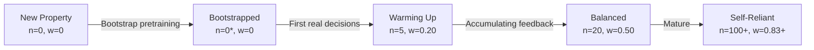

# 03 - Cluster and Model Hierarchy

## The Core Problem: Cold-Start vs. Personalization

Hotel pricing faces a fundamental tension:

- **New properties** have no historical data - the system can't learn price sensitivity from zero observations
- **Established properties** have unique demand patterns - a one-size-fits-all model leaves revenue on the table

The solution is a **two-tier hierarchical model** that borrows strength from similar properties (cluster) while specializing as data accumulates (property-level).

---

## Two Orthogonal Grouping Axes

```
                        ORGANIZATIONAL AXIS (Tenant Hierarchy)
                        ═══════════════════════════════════════
                        
                Chain (Marriott, Hyatt)
                   │
                   ├── Brand (Courtyard, Ritz-Carlton, Hyatt Place, Andaz)
                   │      │
                   │      └── Region (NYC, Chicago, Miami, LA)
                   │             │
                   │             └── Property (individual hotel)
                   │
                   │
                MARKET AXIS (Cluster Hierarchy)
                ═══════════════════════════════
                
                Cluster = Region x Market Tier
                   │
                   ├── nyc_midscale_urban
                   │     ├── Marriott Courtyard NYC #1
                   │     ├── Marriott Courtyard NYC #2
                   │     ├── Hyatt Place NYC #1        ← DIFFERENT chains,
                   │     └── Hyatt Place NYC #2           SAME cluster
                   │
                   ├── nyc_luxury_urban
                   │     ├── Ritz-Carlton NYC #1
                   │     ├── Ritz-Carlton NYC #2
                   │     └── Andaz NYC #1
                   │
                   └── miami_luxury_resort
                         └── Ritz-Carlton Miami #1
```

**Key insight:** Clusters cut ACROSS the organizational hierarchy. Properties from competing chains can share a cluster (same local market, similar demand patterns) while maintaining **strict tenant isolation** in model weights.

---

## Model Scoping: Cluster x Tenant

The backbone model is scoped per **(cluster_id, tenant_id)** - not per cluster alone:

```
┌─────────────────────────────────────────────────────────────────────────────┐
│                        MODEL ARTIFACT LAYOUT                                 │
├─────────────────────────────────────────────────────────────────────────────┤
│                                                                             │
│  model_registry/artifacts/backbone/                                         │
│  ├── marriott__nyc_midscale_urban/    ← Marriott's backbone for this       │
│  │   └── member_0.vw ... member_4.vw     cluster (trained only on           │
│  │                                       Marriott data in this cluster)     │
│  ├── hyatt__nyc_midscale_urban/       ← Hyatt's backbone for SAME          │
│  │   └── member_0.vw ... member_4.vw     cluster (trained only on           │
│  │                                       Hyatt data - SEPARATE weights)     │
│  ├── marriott__nyc_luxury_urban/                                            │
│  └── hyatt__nyc_luxury_urban/                                               │
│                                                                             │
│  model_registry/artifacts/property/                                         │
│  ├── marriott_courtyard_nyc_1/        ← Per-property, fully isolated       │
│  │   ├── model.vw                                                           │
│  │   └── n_observations.txt                                                 │
│  ├── marriott_courtyard_nyc_2/                                              │
│  ├── hyatt_place_nyc_1/                                                     │
│  └── ...                                                                    │
└─────────────────────────────────────────────────────────────────────────────┘
```

**Tenant isolation guarantee:** Two competing chains in the same cluster (e.g., Marriott and Hyatt both in `nyc_midscale_urban`) NEVER share weights or raw training data. They benefit from the same cluster *structure* (arm ladder scaling, context features) but learn independently.

---

## The Ensemble Blend (Credibility Weighting)

At scoring time, both models produce arm probability distributions that are blended using an empirical-Bayes credibility weight:

```
w = n_observations / (n_observations + k)

where:
  n_observations = number of REAL reconciled decisions for this property
  k = blend_smoothing_k (configurable per-tenant, default = 20)


blended_probability[arm_i] = w * property_prob[i] + (1 - w) * backbone_prob[i]
```

### How the Blend Evolves Over a Property's Lifetime

```
n_obs    w (k=20)    Behavior
─────    ────────    ────────────────────────────────────────────────────
   0      0.00       100% backbone - brand new property, pure cold-start
   5      0.20       Mostly backbone, property starting to influence
  10      0.33       Still majority backbone
  20      0.50       Equal weight - property has "earned" its independence
  40      0.67       Mostly property - specialization kicking in
 100      0.83       Strongly self-reliant
 500      0.96       Near-full independence (backbone is a tiny regularizer)
```

```
Backbone Influence ──────────────────────────────────────────────────────>
100% ┤████████████
     │            ████
     │                ████
 50% ┤                    ████
     │                        ████
     │                            ████████
  0% ┤                                    ████████████████████████████████
     └──────┬─────────┬─────────┬─────────┬─────────┬────────────────────
            0        20        40        60       100         observations
            │                   │                   │
            │                   │                   └─ Mature: mostly self
            │                   └─ Balanced: equal blend
            └─ Cold-start: fully relies on cluster backbone
```

### Configuration Knob

```yaml
# config/tenants/_defaults.yaml
ensemble:
  blend_smoothing_k: 20   # How many observations before 50/50 blend
```

Setting `k → 0` makes `w → 1` immediately (full independence from first observation). This is the opt-out path for tenants who don't want cluster pooling at all.

---

## Cluster Definitions

### Current POC Clusters

| Cluster ID | Region | Market Tier | Elasticity Spread | Properties |
|------------|--------|-------------|-------------------|-----------|
| `nyc_midscale_urban` | NYC | midscale | 1.0 | 4 (2 Marriott + 2 Hyatt) |
| `nyc_luxury_urban` | NYC | luxury | 1.3 | 5 (2 Marriott + 2 Hyatt + 1 Andaz) |
| `chicago_midscale_urban` | Chicago | midscale | 1.0 | 2 (1 Marriott + 1 Hyatt) |
| `miami_luxury_resort` | Miami | luxury | 1.3 | 1 (Ritz-Carlton) |
| `la_midscale_urban` | LA | midscale | 1.0 | (placeholder) |
| `la_luxury_urban` | LA | luxury | 1.3 | 1 (Andaz) |

### Elasticity Spread

Each cluster's `elasticity_spread` scales the default arm ladder:

```
Default ladder offset x elasticity_spread = actual arm offset for this cluster

Example (luxury cluster, spread = 1.3):
  "Discount" arm: -15.0% x 1.3 = -19.5%
  "Premium" arm:  +15.0% x 1.3 = +19.5%
  "Peak Premium": +62.5% x 1.3 = +81.25%

Rationale: Luxury guests are less price-sensitive, so the ladder should
cover a wider range to capture the full revenue opportunity.
```

### Cluster Sizing Governance

```yaml
sizing:
  target_min_properties_per_cluster: 3    # below → merge into nearest
  target_max_properties_per_cluster: 500  # above → split into sub-clusters
```

In production, cluster assignments can be data-driven (comp-set overlap graph + KPI similarity via community detection) with the domain-defined clusters as a fallback prior for sparse-data cases.

---

## How the Two Tiers Differ

| Aspect | BackboneModel (Cluster) | PropertyModel (Individual) |
|--------|------------------------|---------------------------|
| **Scope** | 1 per (cluster_id, tenant_id) | 1 per property_id |
| **Purpose** | Shared prior / cold-start fallback | Property-specific specialization |
| **Architecture** | 5-member bag (online-bagging) | Single VW workspace |
| **Update frequency** | Batch-only (nightly retrain) | Online (each reconciled decision) |
| **Update trigger** | `BackboneModel.learn_batch()` | `PropertyModel.learn()` |
| **Data isolation** | Only sees data from its (cluster, tenant) | Only sees its own property's data |
| **Leak risk** | None - batch-only, one property's feedback never leaks instantly | None - physically separate VW workspace |
| **Confidence role** | Bag disagreement → agreement confidence component | n_observations → sample confidence component |
| **Storage** | `backbone/{tenant}__{cluster}/member_*.vw` | `property/{property_id}/model.vw` |

---

## Confidence Score (Three Components)

The ensemble policy also produces a confidence score used for approval routing:

```
confidence = w_sample * sample_score + w_agreement * agreement_score + w_margin * margin_score

Default weights (from config/tenants/_defaults.yaml):
  w_sample    = 0.40   → How much data does this property have?
  w_agreement = 0.35   → Do the 5 backbone bag members agree?
  w_margin    = 0.25   → How decisive is the winner (top vs. 2nd arm)?
```

### Component Breakdown

| Component | Measures | Calculation | Range |
|-----------|----------|-------------|-------|
| **Sample** | Data maturity | `sigmoid(n_observations / k)` | 0 → 1 as data grows |
| **Agreement** | Model certainty | `1 - stdev(bag_member_top_arm_probs)` | Low if members disagree |
| **Margin** | Decision clarity | `(P(best_arm) - P(2nd_arm)) / P(best_arm)` | High if clear winner |

### Confidence Labels and Actions

| Score Range | Label | Action |
|-------------|-------|--------|
| > 0.70 | High | Auto-publish (if delta < 3%) |
| 0.40 - 0.70 | Medium | Auto-publish (if delta < 3%) |
| < 0.40 | Low | Always requires RM approval |

---

## Cold-Start Progression



*Bootstrap pretraining uses `count_as_observation=False` - it updates VW weights (so the property isn't a blank slate) but does NOT increment n_observations. This ensures a freshly bootstrapped property still leans on the backbone until it earns real trust through live interactions.*

### Why This Matters

Without bootstrap pretraining:
- Property model is a blank random slate → pure noise
- Even with w=0 (100% backbone), the property would start with garbage predictions when it eventually gains weight

With bootstrap pretraining (but NOT counting as observations):
- Property model starts with reasonable context→arm mappings
- But n_observations = 0, so w = 0 → backbone still dominates
- As REAL decisions come in, n_observations grows naturally
- The blend smoothly shifts toward the property's own learned preferences

---

## Scaling Considerations

### 10,000+ Properties

```
Properties:     10,000
Clusters:       ~50 (200 properties per cluster avg)
Tenants:        ~10
Backbone models: ~100 (50 clusters x 2 avg tenants per cluster)
Property models: 10,000

Total VW workspaces: ~10,500
Storage per model:   ~50KB (VW is compact)
Total storage:       ~525MB
```

### Nightly Retrain Cost

```
Per backbone: 5 VW workspaces x 3 passes x ~8000 augmented examples = ~120K learn calls
Backbones:    100 models → ~12M learn calls → ~2 minutes on commodity hardware

Per property: 1 VW workspace x ~1500 augmented examples = ~1500 learn calls
Properties:   10,000 → ~15M learn calls → ~3 minutes

Total nightly retrain: ~5-7 minutes (highly parallelizable)
```

---

## Cluster Reassignment

When a property's market dynamics change (e.g., a renovation moves it from midscale to luxury):

1. Update the property's `cluster_id` in the tenant config YAML
2. On next bootstrap/retrain, the property's backbone routing changes automatically
3. The property model's n_observations resets to 0 (starts cold-start in new cluster)
4. The old cluster's backbone is unaffected (the property was just one contributor)

This is a **config change, not a code change** - consistent with the system's design philosophy.

---

## Next

See [04-PROPERTY-ONBOARDING.md](./04-PROPERTY-ONBOARDING.md) for the step-by-step process of adding a new property to the system.
