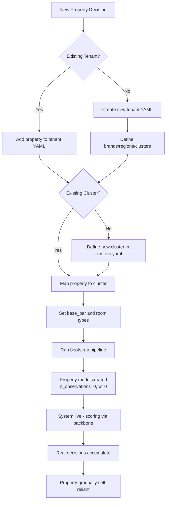

# 04 - Property Onboarding

## Overview

Onboarding a new property into the Dynamic Pricing MAB system is entirely **config-driven** - no code changes required. A new property can be live and scoring within minutes of config deployment, immediately benefiting from its cluster's backbone model (cold-start strategy).

---

## Onboarding Flow



---

## Step-by-Step Onboarding

### Step 1: Determine Tenant and Cluster Assignment

**If the tenant (chain) already exists** (e.g., adding a new Marriott property):
- Identify the correct brand within the tenant
- Determine the region and market tier
- Map to an existing cluster or create a new one

**If the tenant is new** (e.g., onboarding Hilton for the first time):
- Create a new tenant YAML file
- Define brand hierarchy, regions, and cluster mappings

### Step 2: Update Tenant Configuration

**Adding a property to an existing tenant (e.g., a 3rd Courtyard in NYC):**

```yaml
# config/tenants/marriott.yaml
brands:
  - id: courtyard
    market_tier: midscale
    regions:
      - region: NYC
        cluster_id: nyc_midscale_urban
        property_count: 3   # ← was 2, now 3
```

**Adding a completely new tenant:**

```yaml
# config/tenants/hilton.yaml
schema_version: 1
tenant_id: hilton
chain: Hilton
extends: _defaults        # ← inherits room types, rate plans, guardrails, ensemble config

brands:
  - id: hampton_inn
    market_tier: midscale
    regions:
      - region: NYC
        cluster_id: nyc_midscale_urban    # ← shares cluster with Marriott/Hyatt
        property_count: 2                  #    but gets SEPARATE backbone weights
      - region: Chicago
        cluster_id: chicago_midscale_urban
        property_count: 1
  - id: waldorf_astoria
    market_tier: luxury
    regions:
      - region: NYC
        cluster_id: nyc_luxury_urban
        property_count: 1

# Optional: override guardrails for this tenant
guardrails:
  competitive_positioning:
    max_index_vs_compset: 1.50   # more conservative than platform default (1.60)

# Optional: adjust ensemble behavior
ensemble:
  blend_smoothing_k: 30   # slower graduation to self-reliance (more conservative)
```

### Step 3: Define Cluster (if needed)

Only required when the property doesn't fit any existing cluster:

```yaml
# config/clusters.yaml - add a new entry
clusters:
  # ... existing clusters ...
  - id: boston_midscale_urban
    region: Boston
    market_tier: midscale
    description: "Boston midscale/upscale urban business hotels"
    elasticity_spread: 1.0
```

### Step 4: Set Property-Level Attributes

Each property needs at minimum:
- `property_id` (unique identifier)
- `name` (display name)
- `base_bar` (base best-available-rate in $)
- `room_types` (which room types this property has)
- `rate_plans` (which rate plans apply)

These are stored in the database (populated by the data generator in POC, or by a PMS integration in production):

```python
# DB row created during onboarding (db/models.py: Property)
Property(
    property_id="hilton_hampton_nyc_1",
    name="Hampton Inn NYC - Times Square",
    tenant_id="hilton",
    chain="Hilton",
    brand="hampton_inn",
    region="NYC",
    market_tier="midscale",
    cluster_id="nyc_midscale_urban",
    base_bar=189.00,   # base BAR rate
)

# Room types for this property (db/models.py: RoomType)
RoomType(property_id="hilton_hampton_nyc_1", code="standard", multiplier=1.0)
RoomType(property_id="hilton_hampton_nyc_1", code="deluxe", multiplier=1.15)

# Rate plans (db/models.py: RatePlan)
RatePlan(property_id="hilton_hampton_nyc_1", code="bar_best_available", 
         offset_multiplier=1.0, bandit_managed=True)
RatePlan(property_id="hilton_hampton_nyc_1", code="corporate_negotiated",
         offset_multiplier=0.80, bandit_managed=False)  # excluded from bandit
```

### Step 5: Run Bootstrap

```powershell
python -m orchestration.pipelines.run_bootstrap
```

This triggers:
1. **Data generation** (POC only): Generates synthetic historical data for the new property
2. **Backbone training**: If the cluster-tenant pair is new, trains a new backbone from historical data. If it already exists, the new property's data contributes to the next retrain.
3. **Property model bootstrap**: Trains a VW workspace using augmented examples from the cluster's reward model, with `count_as_observation=False`

### Step 6: Verify and Go Live

After bootstrap:
- Property appears in `GET /properties` API response
- Can immediately score via `POST /score`
- Scoring uses 100% backbone (w=0) since n_observations=0
- Confidence will initially be lower (sample component = 0)
- More decisions will route to approval (confidence < 0.4 threshold)

---

## What Happens at Scoring Time (Day 1)

```
New Property (n_observations = 0, blend_weight w = 0.0):

┌─────────────────┐
│  PropertyModel  │  Weights: bootstrap-pretrained (not random)
│  w = 0.0        │  But blend weight is 0% → ignored
└────────┬────────┘
         │ (0% weight)
         v
┌────────────────────────────────────────────┐
│        EnsemblePolicy.decide()             │
│  blended = 0.0 * property + 1.0 * backbone │
│                                            │
│  Confidence:                               │
│    sample    = 0.0 (no real data)          │
│    agreement = depends on backbone bag     │
│    margin    = depends on backbone prediction│
│    TOTAL     = likely 0.3-0.5 (low-medium) │
│                                            │
│  → Most decisions route to approval queue  │
│    (safety net while property is cold)     │
└────────────────────────────────────────────┘
         │ (100% weight)
┌────────┴────────┐
│  BackboneModel  │  Shares cluster knowledge from similar properties
│  w = 1.0        │  Already trained on cluster's historical patterns
└─────────────────┘
```

---

## Onboarding Scenarios

### Scenario A: New Property in Existing Cluster + Existing Tenant

**Example:** Adding a 3rd Marriott Courtyard in NYC

| Step | Action | Time |
|------|--------|------|
| 1 | Update `property_count` in `marriott.yaml` | 1 min |
| 2 | Insert Property/RoomType/RatePlan rows in DB | 1 min |
| 3 | Run bootstrap for the new property only | 2-3 min |
| 4 | Verify via `GET /properties` | instant |

**Backbone already exists** (`marriott__nyc_midscale_urban`) - no need to retrain it. The new property immediately benefits from it.

### Scenario B: New Property in New Cluster

**Example:** First property in a Denver midscale market

| Step | Action | Time |
|------|--------|------|
| 1 | Add `denver_midscale_urban` to `clusters.yaml` | 1 min |
| 2 | Map property to new cluster in tenant YAML | 1 min |
| 3 | Insert DB rows | 1 min |
| 4 | Run full bootstrap (new backbone + property model) | 3-5 min |

**Cold-cold-start:** No cluster history exists. The backbone trains on whatever historical data is available (may be very sparse). The system defaults more heavily to Base Rate until data accumulates.

### Scenario C: New Tenant (Chain) Entirely

**Example:** Onboarding Hilton as a new customer

| Step | Action | Time |
|------|--------|------|
| 1 | Create `hilton.yaml` tenant config | 5 min |
| 2 | Optionally define custom guardrail overrides | 5 min |
| 3 | Add cluster entries if new markets needed | 2 min |
| 4 | Insert all property/room/plan DB rows | varies |
| 5 | Run full bootstrap | 5-10 min |
| 6 | Validate via Scenario Simulator (dry-run) | 5 min |

---

## Configuration Inheritance in Action

A new Hilton property inherits everything from `_defaults.yaml` automatically:

```
What Hilton gets "for free" by extending _defaults:
─────────────────────────────────────────────────────
✓ Room types: standard (1.0x), deluxe (1.15x), suite (1.5x)
✓ Rate plans: BAR, gov/military, senior, special_offer (all bandit-managed)
              + corporate_negotiated (excluded from bandit)
✓ LOS curve: 1-night (1.0x) through 9+ (0.85x)
✓ Channels: direct, ota_mock
✓ Ensemble: blend_smoothing_k = 20
✓ Confidence weights: sample 0.4, agreement 0.35, margin 0.25
✓ Scoring mode: bandit (default)
✓ All guardrails: price bounds, competitive positioning, change frequency, approval thresholds

What Hilton can OVERRIDE:
─────────────────────────
○ Tighter/looser guardrails (e.g., max_index_vs_compset: 1.50)
○ Different blend_smoothing_k (slower/faster graduation)
○ Additional room types or rate plans
○ Custom scoring_mode (baseline/shadow for initial rollout)
○ Approval thresholds (stricter for risk-averse chains)
```

---

## Safe Rollout Strategy for New Properties

For risk-averse onboarding, the recommended progression:

```
Week 1-2:  scoring_mode: "shadow"
           ├── Bandit scores normally, results are LOGGED
           ├── But only baseline (Base Rate) is actually published
           └── Revenue manager reviews shadow vs. baseline comparison

Week 3-4:  scoring_mode: "bandit" + require_approval_if_confidence_below: 0.6
           ├── Bandit is live but with a RAISED approval threshold
           ├── More decisions route to RM for human review
           └── Feedback accumulates, property model starts learning

Week 5+:   scoring_mode: "bandit" (default thresholds)
           ├── Normal operation
           ├── Only large deltas or genuinely low confidence → approval
           └── Property is accumulating observations, becoming self-reliant
```

All of this is achievable through config changes alone - no code deployment needed.

---

## Checklist: Minimum Viable Onboarding

```
□ Tenant YAML exists (or create new one extending _defaults)
□ Property mapped to a cluster
□ Property row in DB (property_id, name, tenant_id, chain, brand, region, cluster_id, base_bar)
□ At least one RoomType row
□ At least one RatePlan row with bandit_managed=true
□ Bootstrap pipeline run successfully
□ Property appears in GET /properties
□ POST /simulate returns a valid ScoreResponse (dry-run test)
□ Dashboard shows property in the Properties tab
```

---

## Production Considerations (Beyond POC)

| POC Approach | Production Approach |
|-------------|-------------------|
| Manual DB inserts | PMS integration auto-syncs properties |
| `run_bootstrap` script | API endpoint or CI/CD-triggered onboarding job |
| Synthetic historical data | Real historical booking data imported from PMS/RMS |
| Single `clusters.yaml` | Data-driven clustering (comp-set graph + KPI similarity) |
| Manual config deployment | GitOps pipeline: PR → review → merge → auto-deploy |

---

## Next

See [05-TRAINING-AND-TESTING.md](./05-TRAINING-AND-TESTING.md) for how models are trained, evaluated, and promoted.
