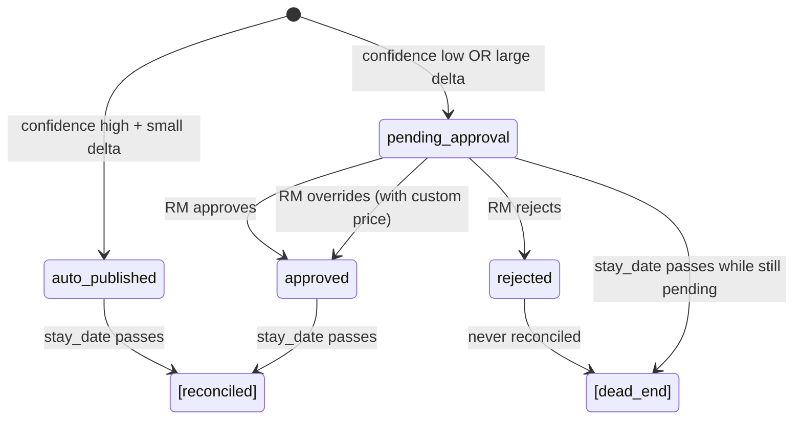

# 06 - Feedback Loop and Revenue Manager Interaction

## Overview

The feedback loop is what makes this system *learn* rather than remain a static pricing engine. It has two channels of feedback:

1. **Revenue Manager (RM) actions** - immediate human signal (approve, reject, override)
2. **Realized booking outcomes** - delayed ground-truth reward (post-stay reconciliation)

Both channels feed into model improvement, but through different mechanisms and at different timescales.

```
┌──────────────────────────────────────────────────────────────────────────────┐
│                        FEEDBACK LOOP OVERVIEW                                 │
│                                                                              │
│   ┌─────────┐    score    ┌───────────┐    decision    ┌──────────────┐    │
│   │  Bandit │ ──────────> │ Guardrails│ ─────────────> │  Decision    │    │
│   │  Engine │             │ + Approval│               │  Logger      │    │
│   └────┬────┘             └───────────┘               └──────┬───────┘    │
│        │                                                      │            │
│        │                                                      v            │
│   ┌────┴──────────────────────────────────────────────────────────────┐   │
│   │                                                                    │   │
│   │  FEEDBACK CHANNEL 1: Revenue Manager Actions (immediate)           │   │
│   │  ─────────────────────────────────────────────────────────────────│   │
│   │                                                                    │   │
│   │  pending_approval ──> RM Reviews ──> approve / reject / override   │   │
│   │                              │                                     │   │
│   │                              │  (no direct model update here -     │   │
│   │                              │   RM actions gate PUBLISHING,       │   │
│   │                              │   not training)                     │   │
│   │                              v                                     │   │
│   │                     Only approved/auto_published                    │   │
│   │                     decisions are reconciled later                  │   │
│   │                                                                    │   │
│   └────────────────────────────────────────────────────────────────────┘   │
│                                                                              │
│   ┌────────────────────────────────────────────────────────────────────┐   │
│   │                                                                    │   │
│   │  FEEDBACK CHANNEL 2: Booking Outcomes (delayed, post-stay)         │   │
│   │  ─────────────────────────────────────────────────────────────────│   │
│   │                                                                    │   │
│   │  stay_date passes ──> Simulate outcome ──> true_reward             │   │
│   │                                                │                   │   │
│   │                                                v                   │   │
│   │                                   PropertyModel.learn()            │   │
│   │                                   (online weight update)           │   │
│   │                                   n_observations++                 │   │
│   │                                                │                   │   │
│   │                                                v                   │   │
│   │                           Property becomes more self-reliant       │   │
│   │                           (blend weight w increases)               │   │
│   │                                                                    │   │
│   └────────────────────────────────────────────────────────────────────┘   │
│        ^                                                                     │
│        │                                                                     │
│        │  Nightly retrain replays reconciled outcomes into the backbone      │
│        │  alongside the oracle examples (batch, quality-gated)               │
│        │                                                                     │
│   ┌────┴────┐                                                                │
│   │  Model  │                                                                │
│   │ Update  │                                                                │
│   └─────────┘                                                                │
└──────────────────────────────────────────────────────────────────────────────┘
```

---

## Revenue Manager Actions

### Decision States



### Routing Logic

```python
def requires_approval(price_delta_pct, confidence, rules):
    # Large price change → always review
    if abs(price_delta_pct) > rules["auto_publish_delta_threshold_pct"]:  # default: 3%
        return True
    # Low confidence → always review  
    if confidence < rules["require_approval_if_confidence_below"]:  # default: 0.4
        return True
    return False
```

| Condition | Example | Result |
|-----------|---------|--------|
| +2% offset, confidence 0.75 | Slight premium, high confidence | Auto-published |
| +15% offset, confidence 0.80 | Premium, high confidence | Approval needed (delta > 3%) |
| +1% offset, confidence 0.30 | Tiny move, low confidence | Approval needed (confidence < 0.4) |
| 0% offset, confidence 0.90 | Base Rate, very confident | Auto-published |

### Three RM Actions

#### 1. Approve
```
POST /approval-queue/{decision_id}/approve

Effect:
  - Decision status: pending_approval → approved
  - Price is published to channels (via Publisher)
  - Decision WILL be reconciled post-stay
  - Signal to model: "this was a good recommendation"
```

#### 2. Reject
```
POST /approval-queue/{decision_id}/reject

Effect:
  - Decision status: pending_approval → rejected
  - Price is NOT published (guests never see it)
  - Decision is NEVER reconciled (no outcome to attribute)
  - Signal to model: NONE directly - but absence of data
    means the model doesn't reinforce this choice
```

#### 3. Override (Approve with Custom Price)
```
POST /approval-queue/{decision_id}/override
Body: { "action": "override", "override_price": 245.00 }

Effect:
  - Decision status: pending_approval → approved
  - override_price is stored alongside original published_price
  - The OVERRIDE price is published (not the bandit's recommendation)
  - Decision IS reconciled, using the override price for outcome simulation
  - The bandit's originally chosen arm is credited with the outcome
    (teaches: "when I picked this arm in this context, the RM adjusted
    to this price, and the outcome was X")
```

---

## How RM Actions Teach the Model

Revenue manager actions don't directly call `model.learn()` - they influence learning **indirectly** through the reconciliation filter:

```
┌───────────────────────────────────────────────────────────────┐
│                  RM Action → Learning Impact                   │
├─────────────┬─────────────────────────────────────────────────┤
│ Action      │ Impact on Model Learning                         │
├─────────────┼─────────────────────────────────────────────────┤
│             │                                                 │
│ APPROVE     │ Decision enters the reconciliation pipeline.    │
│             │ After stay_date, the true outcome (booked or    │
│             │ not) is observed at the BANDIT's recommended    │
│             │ price. If the arm was good for that context,    │
│             │ it gets positive reward → model reinforces.     │
│             │                                                 │
├─────────────┼─────────────────────────────────────────────────┤
│             │                                                 │
│ REJECT      │ Decision is EXCLUDED from reconciliation.       │
│             │ No outcome is ever observed. Model receives     │
│             │ no signal (positive or negative) for this       │
│             │ (context, arm) pair.                            │
│             │                                                 │
│             │ Implicit effect: if the model keeps suggesting  │
│             │ an arm that gets rejected, it never receives    │
│             │ positive reinforcement for it → exploration     │
│             │ will eventually try other arms that DO get      │
│             │ approved and generate real reward signals.      │
│             │                                                 │
├─────────────┼─────────────────────────────────────────────────┤
│             │                                                 │
│ OVERRIDE    │ Decision enters reconciliation, BUT the outcome │
│             │ is simulated at the OVERRIDE price (what the    │
│             │ guest actually saw), not the bandit's price.    │
│             │                                                 │
│             │ The learning update credits the bandit's        │
│             │ ORIGINAL arm choice with whatever reward the    │
│             │ override price produced. This teaches:          │
│             │                                                 │
│             │ "In this context, when I chose arm X, the       │
│             │  human adjusted my price to Y, and the result   │
│             │  was reward Z. If Z is low → maybe arm X was    │
│             │  wrong for this context."                       │
│             │                                                 │
│             │ Over time, if overrides consistently produce    │
│             │ better outcomes than the bandit's raw picks,    │
│             │ the model learns toward what the RM prefers.    │
│             │                                                 │
└─────────────┴─────────────────────────────────────────────────┘
```

---

## Reward Reconciliation (Post-Stay)

### When Does It Run?

Reconciliation runs as part of the nightly pipeline (`run_nightly.py` Step 1), but conceptually it's a separate concern: joining decisions with their real-world outcomes.

### What Qualifies for Reconciliation?

```sql
-- Pseudocode for the reconciliation query:
SELECT * FROM decisions WHERE
    is_historical = FALSE       -- not synthetic bootstrap data
    AND is_dry_run = FALSE      -- not Scenario Simulator
    AND reconciled_at IS NULL   -- not already processed
    AND stay_date <= today      -- stay has actually occurred
    AND status IN ('approved', 'auto_published')  -- was actually live/servable
```

**Explicitly excluded:**
- `rejected` decisions - price was never shown to a guest
- `pending_approval` that expired - never acted upon
- `is_dry_run` - Scenario Simulator results
- `is_historical` - synthetic bootstrap data

### Reconciliation Process

```
For each qualifying decision:

1. DETERMINE EFFECTIVE PRICE
   ┌─────────────────────────────────────────────────────┐
   │ if override_price is not None:                       │
   │     effective_price = override_price                  │
   │     effective_offset = (override_price / ref_rate) - 1│
   │ else:                                                │
   │     effective_price = published_price                 │
   │     effective_offset = arm_offset_pct                 │
   └─────────────────────────────────────────────────────┘

2. SIMULATE REALIZED OUTCOME (POC: demand_model oracle)
   ┌─────────────────────────────────────────────────────┐
   │ outcome = simulate_outcome(context, effective_offset,│
   │                            rate_plan, rng)           │
   │                                                     │
   │ outcome contains:                                    │
   │   - booked: bool (did the guest book?)              │
   │   - cancelled: bool (did they cancel later?)         │
   │   - channel: "direct" or "ota_mock"                 │
   └─────────────────────────────────────────────────────┘

3. COMPUTE REWARDS
   (see context_generator/demand_model.py :: compute_rewards)
   ┌─────────────────────────────────────────────────────┐
   │ proxy_reward = 1.0 if booked else 0.0                │
   │   -> a BINARY flag, not a dollar amount. Used as     │
   │      the training label for the XGBoost reward       │
   │      model (P(booked) ~ context + offset).           │
   │                                                     │
   │ if booked AND not cancelled:                         │
   │     true_reward = effective_price                     │
   │                 * (1 - channel_commission)            │
   │ else:                                                │
   │     true_reward = 0.0                                │
   │                                                     │
   │   -> cancellation is a HARD zero, not a scaling      │
   │      factor. A cancelled booking earns nothing.      │
   │   -> commission: direct = 0%, ota_mock = 15%         │
   │                                                     │
   │ Examples ($250 price):                               │
   │   booked, stayed, direct  -> $250.00                │
   │   booked, stayed, OTA     -> $212.50 (15% cut)      │
   │   booked, then cancelled  -> $0.00                  │
   │   never booked            -> $0.00                  │
   └─────────────────────────────────────────────────────┘

   NOTE: `compute_rewards`' docstring says the proxy reward drives the
   property model's online loop and the true reward drives the backbone.
   In the current code, reward_reconciliation.py feeds `true_reward` to
   PropertyModel.learn() - the proxy is only consumed as the offline
   reward-model label. Treat the docstring as intent, the code as truth.

4. ONLINE LEARNING UPDATE
   ┌─────────────────────────────────────────────────────┐
   │ PropertyModel.learn(                                 │
   │     context = original_context_from_decision,        │
   │     arms = ladder_for_cluster,                       │
   │     chosen_pos = position_of_bandit's_original_arm,  │
   │     propensity = logged_propensity,                  │
   │     reward = true_reward,                            │
   │     count_as_observation = True,  ← increments n!    │
   │ )                                                    │
   └─────────────────────────────────────────────────────┘

5. PERSIST
   - row.proxy_reward = proxy_reward
   - row.true_reward = true_reward
   - row.reconciled_at = utcnow()
   - model.save()
```

---

## Feedback Signal: Is the Published Price Working?

The key question a revenue manager asks: *"Is the bandit's pricing actually working?"*

The system answers this through multiple lenses:

### 1. Direct Outcome Feedback (Per-Decision)

After each decision's stay date passes:

```
Decision: "Slight Premium" (+6.5%) was published for NYC property, Friday stay

Outcome A (positive):
  Guest booked at $267 (vs $250 base) → true_reward = $227 (after commission)
  → Model reinforces: "in high-demand Friday contexts, Slight Premium works"

Outcome B (negative):
  Guest did NOT book at $267 → true_reward = $0
  → Model learns: "maybe this context didn't warrant a premium"
  → Next time in similar context, model assigns less probability to this arm
```

### 2. Fleet-Wide Monitoring (Aggregate Trends)

The `/metrics` endpoint and Grafana dashboards show:

| Metric | What It Reveals |
|--------|----------------|
| Arm distribution | Is the model exploring enough? Stuck on one arm? |
| Override rate | Are RMs frequently disagreeing with the model? |
| Confidence histogram | Is the model becoming more certain over time? |
| Revenue per decision | Is average yield improving week-over-week? |
| Approval queue depth | Is the system overwhelming RMs with review requests? |
| Booking rate by arm | Which arms are actually converting? |

### 3. Backtest Quality Gate (Nightly)

Every night, the retrained model is backtested against the static baseline:

```
If bandit_revenue > baseline_revenue (with statistical confidence):
  → Model is demonstrably better than "do nothing"
  → Promoted to production

If not:
  → Model hasn't learned enough yet (or has regressed)
  → Rolled back to previous version
  → System never gets WORSE than the last known-good model
```

---

## How the Model Improves Over Time

```
Week 1 (cold-start):
├── Property blend weight: w ≈ 0 (100% backbone)
├── Confidence: mostly Low (many decisions → approval queue)
├── RM approves/rejects → filters what enters training
├── Post-stay: first real rewards flow in
└── n_observations: 0 → 5-10

Week 2-3 (warming up):
├── w ≈ 0.2-0.3 (property starting to influence)
├── Model has seen ~20 real outcomes
├── Patterns emerging: "weekends need premiums, Tuesdays don't"
├── Confidence improving: fewer approval-queue items
└── Override rate dropping (model aligns with RM preferences)

Week 4-8 (maturing):
├── w ≈ 0.5-0.7 (property mostly self-reliant)
├── Model has learned property-specific demand patterns
├── Most decisions auto-publish (confidence > threshold)
├── Nightly backtests consistently beat baseline
└── Revenue measurably improved vs. static pricing

Ongoing (mature):
├── w ≈ 0.8-0.95 (backbone is a light regularizer)
├── Online learning tracks seasonal/market shifts
├── Nightly retrain catches structural changes
├── Quality gate protects against regressions
└── RM role: exception handling, not routine review
```

---

## Handling Revenue Manager Overrides Intelligently

### The Override Learning Signal

When a revenue manager overrides a price, the system learns from *what actually happened at the override price*:

```
Scenario: Bandit picks "Premium" (+15%), RM overrides to +8%

┌─────────────────────────────────────────────────────────────────┐
│ What the model learns:                                           │
│                                                                  │
│ Context: High occupancy Friday, event nearby                     │
│ Bandit chose: arm_5 ("Premium", +15%)                           │
│ RM overrode to: +8% (between Slight Premium and Premium)         │
│ Guest: BOOKED at the override price                              │
│ True reward: $230 (price x booked x (1-cancel) x (1-commission))│
│                                                                  │
│ Learning update: arm_5 in this context → reward $230             │
│                                                                  │
│ Over many similar overrides:                                     │
│ - If RM consistently overrides DOWN and guests book → model      │
│   learns that lower arms work better in this context             │
│ - If RM overrides UP and guests still book → model learns        │
│   it was being too conservative                                  │
│ - The model converges toward what the RM+market validates        │
└─────────────────────────────────────────────────────────────────┘
```

### Override Patterns the System Detects (via Monitoring)

| Pattern | Interpretation | System Response |
|---------|---------------|-----------------|
| RM always overrides down by 5-10% | Model is systematically too aggressive | Over time, model learns lower arms produce better reward (via reconciled outcomes at override prices) |
| RM always overrides up | Model is too conservative | Model learns higher arms are viable (guests still book at higher prices) |
| RM overrides vary by context | RM has domain knowledge about specific scenarios | Model learns context-dependent preferences (e.g., "corporate segment tolerates premiums") |
| Override rate decreasing over time | Model is converging with RM preferences | Healthy learning - the system is working |
| Override rate increasing | Something changed (new market condition?) | Investigate: possibly need config/cluster adjustment |

---

## Rejection as Implicit Negative Signal

While rejection doesn't directly feed `model.learn()`, it has an important indirect effect:

```
Scenario: Model repeatedly suggests "Demand Surge" (+45%) for a property

Week 1: Suggested 5 times, RM rejects all 5
  → 0 reconciled outcomes for this arm in this context
  → Model receives no positive reinforcement
  → Meanwhile, Base Rate decisions that ARE approved get booked → positive reward

Week 2: Model still suggests "Demand Surge" sometimes (exploration)
  → RM rejects again → still no reward signal
  → Auto-published Base Rate decisions continue getting positive rewards
  
Week 3: Model has enough evidence:
  → "Demand Surge" arm has ZERO positive reward in this property/context
  → "Base Rate" and "Slight Premium" have accumulated positive rewards
  → Model shifts probability away from Demand Surge for this context
  
Result: The model learns through the ABSENCE of positive signal,
not through explicit negative reward. This is slower but avoids
punishing the model for suggestions the RM vetoed before testing.
```

---

## Feedback Loop Timelines

```
Decision Made (t=0)
│
├── IMMEDIATE: Status determined (auto_published or pending_approval)
│              If auto_published → published to channels instantly
│
├── HOURS/DAYS: RM reviews pending decisions
│               Approve → publish to channels
│               Reject → dead end (no further learning from this decision)
│               Override → publish override price to channels
│
├── DAYS/WEEKS: Stay date arrives and passes
│               (lead_time_days determines the gap)
│
├── NEXT NIGHT: Reconciliation runs (nightly pipeline)
│               ├── Simulates outcome at effective price
│               ├── Computes true_reward
│               ├── PropertyModel.learn() ← ONLINE UPDATE
│               └── n_observations++
│
└── SAME NIGHT: Nightly retrain
                ├── Backbone retrained on historical rows + reconciled real
                │     outcomes (the update above now reaches the pooled model)
                ├── Property models left intact - this run's online update
                │     and its n_observations increment are preserved
                ├── Quality gate (backtest); on failure only backbones revert
                └── Promote or rollback

Total feedback latency: lead_time_days + 1 night
  - Short lead time (1-2 days): feedback in ~2-3 days
  - Long lead time (30+ days): feedback in ~31+ days
```

---

## Measuring "Is It Working?"

### For a Single Property

```
Metrics to track in Grafana / /metrics endpoint:

1. Revenue per Available Room-Night (RevPAR lift)
   = (bandit avg revenue) / (baseline period avg revenue) - 1
   Target: > 0% (any positive lift is value)

2. Booking Conversion Rate by Arm
   = bookings / decisions per arm
   Healthy: discount arms have higher conversion, premium arms lower but non-zero

3. Override Rate Trend
   = overrides / total_approved over time
   Healthy: declining (model learning from RM)

4. Confidence Score Trend
   = avg confidence over time
   Healthy: increasing (model becoming more certain)

5. Arm Distribution Entropy
   = -Σ p(arm) * log(p(arm))
   Healthy: moderate entropy (exploring, not stuck on one arm)
   Unhealthy: near-zero (always same arm) or maximum (completely random)
```

### For the Fleet

```
6. Quality Gate Pass Rate
   = nights_promoted / total_nights
   Target: > 90% (occasional rollbacks are OK, frequent ones indicate a problem)

7. Cross-Property Consistency
   = variance of arm choices across similar properties in same cluster
   Low variance: backbone is doing its job (similar properties behave similarly)
   
8. Time to Self-Reliance
   = days until w > 0.5 for new properties
   Benchmark: ~2-4 weeks with 1 decision/day
```

---

## Feedback Loop Safety Mechanisms

| Mechanism | Protects Against |
|-----------|-----------------|
| Approval routing (confidence + delta thresholds) | Bad recommendations reaching guests before human review |
| Quality gate (nightly backtest) | Deploying a model that's worse than baseline |
| Model rollback | Regression from a bad retrain |
| Scoring mode: baseline | Emergency kill-switch when everything else fails |
| Scoring mode: shadow | Safe A/B testing without guest-facing risk |
| Tenant isolation | One chain's bad data corrupting another's model |
| Property isolation (separate VW workspace) | One property's anomalous feedback polluting neighbors |
| `count_as_observation=False` for bootstrap | Synthetic data inflating credibility weight |
| Only reconcile approved/auto_published | Rejected decisions don't punish the model unfairly |
| Override price used for outcome simulation | RM's price adjustment is respected in reward computation |
| max_changes_per_day guardrail | Rate instability from too-frequent updates |

---

## Production Evolution (Beyond POC)

| POC (Current) | Production Enhancement |
|---------------|----------------------|
| Simulated outcomes via demand model oracle | Real PMS/booking-engine webhooks (booked/cancelled/no-show) |
| Nightly batch reconciliation | Near-real-time event-driven reconciliation (as bookings arrive) |
| Simple proxy_reward = price * booked | Rich reward: RevPAR, total revenue including ancillary, LTV |
| Single reconciliation pass | Multi-touch attribution (guest saw price, booked 3 days later) |
| Override credits original arm | Counterfactual analysis: "what would have happened at bandit's price?" |
| RM feedback via Approval Queue UI | API integrations with existing RMS tools (e.g., IDeaS, Duetto) |
| Monitoring via Grafana | Automated alerting: drift detection, confidence collapse, override spike |

---

## Summary: The Virtuous Cycle

```
┌─────────────────────────────────────────────────────────┐
│                                                         │
│   Bandit recommends → RM approves → Guest sees price   │
│                                          │              │
│                                          v              │
│                                   Outcome observed      │
│                                   (booked / not)        │
│                                          │              │
│                                          v              │
│                                   Reward computed       │
│                                          │              │
│                                          v              │
│   Model improves ←── PropertyModel.learn() ←───────┘   │
│        │                                                │
│        v                                                │
│   Better recommendations next time                      │
│        │                                                │
│        v                                                │
│   Higher confidence → more auto-publishes               │
│        │                                                │
│        v                                                │
│   Less RM workload + better revenue                     │
│        │                                                │
│        └──────────────────────────────────────────┐     │
│                                                   │     │
│   RM focuses on exceptions, not routine ←─────────┘     │
│                                                         │
└─────────────────────────────────────────────────────────┘
```

The end state: the revenue manager's role shifts from reviewing every price change to **exception handling and strategic oversight** - stepping in only when the model encounters genuinely novel situations it hasn't learned from yet.
